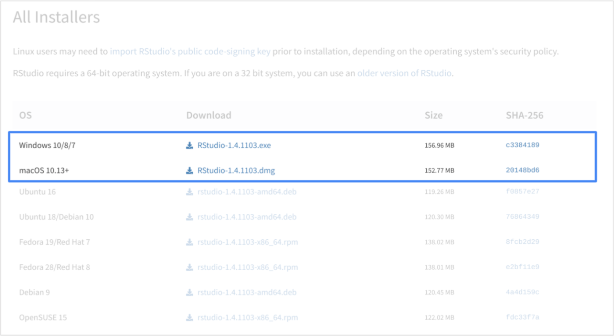

# Practice Quiz: Optional Hands-On Activity: Get started in RStudio Desktop

## Activity Overview

In earlier activities, you explored programming with R and may have downloaded R to your computer. You also set up cloud access to RStudio, an integrated development environment for programming in R. In this activity, you will download RStudio Desktop--the offline version of RStudio--to your computer.

By the end of this activity, you will be able to use RStudio Desktop on your computer. This will give you more flexibility while programming with R, as you will be able to access everything RStudio has to offer even if you are not connected to the internet.

## Download RStudio Desktop

Note: This is an optional activity. RStudio Cloud is the primary tool we will use for this course, but you can also use RStudio Desktop if you have R installed. Please keep in mind that Chrome OS does not support the installation of R. If you are completing this course on a Chromebook, we suggest that you skip this activity or refer to the Linux workaround linked in this activity.

RStudio allows you to create and manage projects using R more efficiently. You can find more information about RStudio Desktop on the [RStudio website](https://www.rstudio.com/). It is available to download with the open-source edition, so it is free to use under a public license. The free trial of RStudio Pro, which has all of the features of the open-source edition and a commercial license, is also on this website.

1. Determine which operating system (OS) you have on your computer. Some common OS’s include MacOS (Apple), Windows OS (Microsoft), and Chrome OS (Google).

2. If you haven’t already, install R onto your computer. You can find the links to download R for Mac, Windows, and Linux on the [CRAN website](https://cran.rstudio.com/). For more information, refer to a previous activity, [Downloading and Installing R](https://www.coursera.org/learn/data-analysis-r/quiz/mWN3I/optional-hands-on-activity-downloading-and-installing-r).

3. Once you have installed R, go to the [RStudio Desktop download page](https://rstudio.com/products/rstudio/download/#download).

    

4. Download the appropriate RStudio Desktop installer for your operating system.

5. Once you have downloaded the installer, open it and install **RStudio**.

6. After installation, open the application for the first time. You should find the RStudio console you are already familiar with--but now you can access it locally.

## Install and Load Packages

You can install and load packages in your RStudio Desktop console, just like you did for RStudio Cloud. Now, you will install and load the lubridate package in the tidyverse.

As a refresher, the tidyverse is a collection of packages in R with a common design philosophy for data manipulation, exploration, and visualization. For a lot of data analysts, the tidyverse is an essential tool.

1. To install the core tidyverse packages, type `install.packages("tidyverse")` into the RStudio console pane and click Run.

2. Load the tidyverse library with the `library()` function. Type `library(tidyverse)` into the console pane and click **Run**.

    You only need to install a package once, but you need to reload it every time you start a new session.

3. Load the lubridate package. Type `library(lubridate)` ([library](https://rdrr.io/r/base/library.html)-[lubridate](https://lubridate.tidyverse.org/))into the console pane and click Run.

After you have loaded this package into your RStudio Desktop console, exit the program. Now, you will be able to use RStudio with tidyverse whether you are connected to the internet or not.

## Reflection

In this activity, you installed RStudio to your computer and loaded the tidyverse R package. In the text box below, write 2-3 sentences (40-60 words) in response to each of the following questions:

- **What are some benefits of using RStudio Desktop instead of RStudio Cloud?**
- **What are some drawbacks?**

**My Reflection:**

- **Benefits of Using RStudio Desktop:**
  RStudio Desktop offers offline access, providing more flexibility and allowing users to work on their projects without requiring an internet connection. It also typically provides faster performance compared to cloud-based solutions, especially when working with large datasets or complex analyses.

- **Drawbacks:**
  One drawback of using RStudio Desktop is that it requires installation and setup on each individual user's computer, which can be cumbersome for large teams or in environments where users frequently switch between devices. Additionally, updates and maintenance are the responsibility of the user, whereas cloud-based solutions often handle these aspects automatically.

> Correct:
> Congratulations on completing this hands-on activity! A good response would include that RStudio Desktop allows you to use RStudio locally, even if you aren’t connected to the internet.
>
> RStudio allows you to create and manage projects using R more efficiently. If you need to access RStudio without an internet connection, RStudio Desktop is a useful tool to have. On the other hand, RStudio Cloud gives you the flexibility of accessing your account from any computer. Which version you use will depend on your device as well as your preference.
