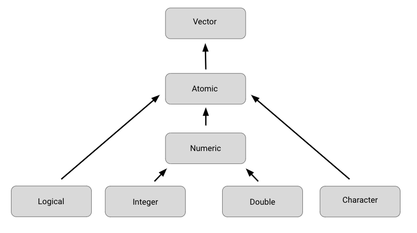

# Reading: Vectors and Lists in R

*You can save this reading for future reference. Feel free to download a PDF version of this reading below:*

[Vectors and lists in R](./resources/vectors-and-lists-in-R.pdf)

In programming, a **data structure** is a format for organizing and storing data. Data structures are essential to understand because you will work with them frequently when you use R for data analysis. The most common data structures in the R programming language include:

- Vectors
- Data frames
- Matrices
- Arrays

Think of a data structure like a house that contains your data.


This reading will focus on vectors. Later on, you’ll learn more about data frames, matrices, and arrays.

## Atomic Vectors

There are two types of vectors: atomic vectors and lists. Let's explore the basic properties of atomic vectors first.

### Types of Atomic Vectors

A vector is a group of data elements of the same type, stored in a sequence in R. There are six primary types of atomic vectors:

- Logical
- Integer
- Double
- Character

Together, integer and double vectors are known as numeric vectors because they both contain numbers.

#### Atomic Vectors Summary

First, we will go through the different types of atomic vectors. Then, you will learn how to use R code to create, identify, and name the vectors.

Earlier, you learned that a vector is a group of data elements of the same type, stored in a sequence in R. You cannot have a vector that contains both logicals and numerics.

There are six primary types of atomic vectors: logical, integer, double, character (which contains strings), complex, and raw. The last two–complex and raw–aren’t as common in data analysis, so we will focus on the first four. Together, integer and double vectors are known as numeric vectors because they both contain numbers. This table summarizes the four primary types:

| Type     | Description              | Example  |
|----------|--------------------------|----------|
| Logical  | True/False               | `TRUE`    |
| Integer  | Positive and negative whole values | `3` |
| Double   | Decimal values           | `101.175`  |
| Character| String/character values  | "`Coding`" |

This diagram illustrates the hierarchy of relationships among these four main types of vectors:



### Creating Vectors

You can create a vector using the `c()` function, which stands for "combine." For example:

```r
c(2.5, 48.5, 101.5)
c(1L, 5L, 15L)  # Integers with 'L' suffix
c("Sara", "Lisa", "Anna")
c(TRUE, FALSE, TRUE)
```

### Properties of Vectors

Every vector has two key properties: type and length. You can determine the type of a vector using the `typeof()` function and its length using the `length()` function. For example:

```r
typeof(c("a", "b"))  # Output: "character"
length(c(33.5, 57.75, 120.05))  # Output: 3
```

### Naming Vectors

You can name the elements of a vector using the `names()` function. For example:

```r
x <- c(1, 3, 5)
names(x) <- c("a", "b", "c")
x
# Output:
# a b c
# 1 3 5
```

## Lists

Lists are different from atomic vectors because their elements can be of any type, and they can even contain other lists.

### Creating Lists

You can create a list using the `list()` function. For example:

```r
list("a", 1L, 1.5, TRUE)
list(list(list(1, 3, 5)))  # Nested lists
```

### Properties of Lists

You can determine the structure of a list using the `str()` function. For example:

```r
str(list("a", 1L, 1.5, TRUE))
str(list(list(list(1, 3, 5))))
```

### Naming Lists

You can name the elements of a list when creating it with the `list()` function. For example:

```r
list('Chicago' = 1, 'New York' = 2, 'Los Angeles' = 3)
```

## Additional Resource

To learn more about vectors and lists, check out [R for Data Science, Chapter 20: Vectors](https://r4ds.had.co.nz/vectors.html). This chapter is an excellent resource for understanding vectors and lists in R for data science and analysis.