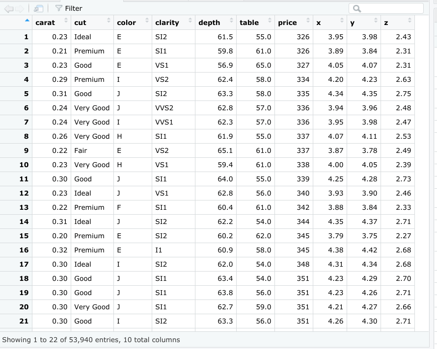

# Reading: Other common data structures

In this reading, you will continue on the topic of data structures with an introduction to data frames and matrices. You will learn about the basic properties of each structure, and simple ways to make use of them using R code. You will also briefly explore files, which are often used to access and store data and related information.

## Data structures

Recall that a data structure is like a house that contains your data.


### Data frames

Data frames are the most common way of storing and analyzing data in R, so it’s important to understand what they are and how to create them. A data frame is a collection of columns–similar to a spreadsheet or SQL table. Each column has a name at the top that represents a variable, and includes one observation per row. Data frames help summarize data and organize it into a format that is easy to read and use.

For example, the data frame below shows the “diamonds” dataset, which is one of the preloaded datasets in R. Each column contains a single variable that is related to diamonds: carat, cut, color, clarity, depth, and so on. Each row represents a single observation.



There are a few key things to keep in mind when you are working with data frames:

- Columns should be named.
- Data frames can include many different types of data, like numeric, logical, or character.
- Elements in the same column should be of the same type.

You will learn more about data frames later on in the program, but this is a great starting point.

If you need to manually create a data frame in R, you can use the `data.frame()` function. The `data.frame()` function takes vectors as input. In the parentheses, enter the name of the column, followed by an equals sign, and then the vector you want to input for that column. In this example, the x column is a vector with elements 1, 2, 3, and the y column is a vector with elements 1.5, 5.5, 7.5.

```R
data.frame(x = c(1, 2, 3), y = c(1.5, 5.5, 7.5))
```

If you run the function, R displays the data frame in ordered rows and columns.

```
   x   y
1  1 1.5
2  2 5.5
3  3 7.5
```

In most cases, you won’t need to manually create a data frame yourself, as you will typically import data from another source, such as a .csv file, a relational database, or a software program.

### Files

Let’s go over how to create, copy, and delete files in R. For more information on working with files in R, check out [R documentation: files](https://www.rdocumentation.org/packages/base/versions/3.6.2/topics/files). *R documentation* is a tool that helps you easily find and browse the documentation of almost all R packages on CRAN. It’s a useful reference guide for functions in R code. Let’s go through a few of the most useful functions for working with files.

Use the `dir.create` function to create a new folder, or directory, to hold your files. Place the name of the folder in the parentheses of the function.

```R
dir.create("destination_folder")
```

Use the `file.create()` function to create a blank file. Place the name and the type of the file in the parentheses of the function. Your file types will usually be something like .txt, .docx, or .csv.

```R
file.create("new_text_file.txt")
file.create("new_word_file.docx")
file.create("new_csv_file.csv")
```

If the file is successfully created when you run the function, R will return a value of TRUE (if not, R will return FALSE).

```R
file.create("new_csv_file.csv")
[1] TRUE
```

Copying a file can be done using the `file.copy()` function. In the parentheses, add the name of the file to be copied. Then, type a comma, and add the name of the destination folder that you want to copy the file to.

```R
file.copy("new_text_file.txt", "destination_folder")
```

If you check the Files pane in RStudio, a copy of the file appears in the relevant folder.

You can delete R files using the `unlink()` function. Enter the file’s name in the parentheses of the function.

```R
unlink("some_.file.csv")
```

### Additional resource

If you want to learn more about working with data frames, matrices, and arrays in R, check out the [Data Wrangling section of Stat Education's Introduction to R course](http://statseducation.com/Introduction-to-R/modules/getting%20data/data-wrangling/). The section includes modules on data frames, matrices, and arrays (and more), and each module contains helpful examples of key coding concepts.

## Optional: Matrices

A **matrix** is a two-dimensional collection of data elements. This means it has both rows and columns. By contrast, a vector is a one-dimensional sequence of data elements. But like vectors, matrices can only contain a single data type. For example, you can’t have both logicals and numerics in a matrix.

To create a matrix in R, you can use the `matrix()` function. The `matrix()` function has two main arguments that you enter in the parentheses. First, add a vector. The vector contains the values you want to place in the matrix. Next, add at least one matrix dimension. You can choose to specify the number of rows or the number of columns by using the code `nrow =` or `ncol =`.

For example, imagine you want to create a 2x3 (two rows by three columns) matrix containing the values 3-8. First, enter a vector containing that series of numbers: `c(3:8)`. Then, enter a comma. Finally, enter `nrow = 2` to specify the number of rows.

```R
matrix(c(3:8), nrow = 2)
```

If you run the function, R displays a matrix with three columns and two rows (typically referred to as a “2x3”) that contain the numeric values 3, 4, 5, 6, 7, 8. R places the first value (3) of the vector in the uppermost row, and the leftmost column of the matrix, and continues the sequence from left to right.

```R
    [,1] [,2] [,3]
[1,]    3    5    7
[2,]    4    6    8
```

You can also choose to specify the number of columns (`ncol =`) instead of the number of rows (`nrow =`).

```R
matrix(c(3:8), ncol = 2)
```

When you run the function, R infers the number of rows automatically.

```
    [,1] [,2] 
[1,]    3    6    
[2,]    4    7    
[3,]    5

    8   
```