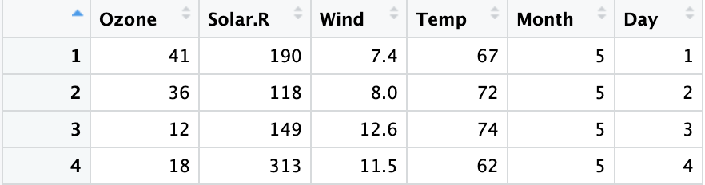

# Reading: Logical operators and conditional statements

Tip: You may refresh on the concepts presented in [Understanding Boolean logic](../../../3_Prepare-Data-for-Exploration/1_Module-1_Data-types-and-structures/4_Explore-data-types-fields-values/2_READING_Understanding-Boolean-logic.md) to help you understand how logical operators work.

You can save this reading for future reference. Feel free to download a PDF version of this reading below:

Earlier, you learned that an operator is a symbol that identifies the type of operation or calculation to be performed in a formula. In this reading, you will learn about the main types of logical operators and how they can be used to create conditional statements in R code.


## Logical operators

Logical operators return a logical data type such as TRUE or FALSE.

There are three primary types of logical operators:

- AND (sometimes represented as & or && in R)
- OR (sometimes represented as | or || in R)
- NOT (!)

Review the summarized logical operators below.

## AND operator “&”

The AND operator takes two logical values. It returns TRUE only if both individual values are TRUE. This means that TRUE & TRUE evaluates to TRUE. However, FALSE & TRUE, TRUE & FALSE, and FALSE & FALSE all evaluate to FALSE.

If you run the corresponding code in R, you get the following results:

```R
> TRUE & TRUE
[1] TRUE
> TRUE & FALSE
[1] FALSE
> FALSE & TRUE
[1] FALSE
> FALSE & FALSE
[1] FALSE
```

You can illustrate this using the results of our comparisons. Imagine you create a variable x that is equal to 10.

```R
x <- 10
```

To check if x is greater than 3 but less than 12, you can use x > 3 and x < 12 as the values of an “AND” expression.

```R
x > 3 & x < 12
```

When you run the function, R returns the result TRUE.

```R
[1] TRUE
```

The first part, x > 3 will evaluate to TRUE since 10 is greater than 3. The second part, x < 12 will also evaluate to TRUE since 10 is less than 12. So, since both values are TRUE, the result of the AND expression is TRUE. The number 10 lies between the numbers 3 and 12.

However, if you make x equal to 20, the expression x > 3 & x < 12 will return a different result.

```R
x <- 20
x > 3 & x < 12
```

```R
[1] FALSE
```

Although x > 3 is TRUE (20 > 3), x < 12 is FALSE (20 < 12). If one part of an AND expression is FALSE, the entire expression is FALSE (TRUE & FALSE = FALSE). So, R returns the result FALSE.

## OR operator “|”

The OR operator (|) works in a similar way to the AND operator (&). The main difference is that at least one of the values of the OR operation must be TRUE for the entire OR operation to evaluate to TRUE. This means that TRUE | TRUE, TRUE | FALSE, and FALSE | TRUE all evaluate to TRUE. When both values are FALSE, the result is FALSE.

If you write out the code, you get the following results:

```R
> TRUE | TRUE
[1] TRUE
> TRUE | FALSE
[1] TRUE
> FALSE | TRUE
[1] TRUE
> FALSE | FALSE
[1] FALSE
```

For example, suppose you create a variable y equal to 7. To check if y is less than 8 or greater than 16, you can use the following expression:

```R
y <- 7
y < 8 | y > 16
```

The comparison result is TRUE (7 is less than 8) | FALSE (7 is not greater than 16). Since only one value of an OR expression needs to be TRUE for the entire expression to be TRUE, R returns a result of TRUE.

```R
[1] TRUE
```

Now, suppose y is 12. The expression y < 8 | y > 16 now evaluates to FALSE (12 < 8) | FALSE (12 > 16). Both comparisons are FALSE, so the result is FALSE.

```R
y <- 12
y < 8 | y > 16
```

```R
[1] FALSE
```

## NOT operator “!”

The NOT operator (!) simply negates the logical value it applies to. In other words, !TRUE evaluates to FALSE, and !FALSE evaluates to TRUE.

When you run the code, you get the following results:

```R
> !TRUE
 [1] FALSE
> !FALSE
[1] TRUE
```

Just like the OR and AND operators, you can use the NOT operator in combination with logical operators. Zero is considered FALSE and non-zero numbers are taken as TRUE. The NOT operator evaluates to the opposite logical value.

Let’s imagine you have a variable x that equals 2:

```R
x <- 2
```

The NOT operation evaluates to FALSE because it takes the opposite logical value of a non-zero number (TRUE).

```R
> !x
[1] FALSE
```

Let’s check out an example of how you might use logical operators to analyze data. Imagine you are working with the airquality dataset that is preloaded in RStudio. It contains data on daily air quality measurements in New York from May to September of 1973.

The data frame has six columns: Ozone (the ozone measurement), Solar.R (the solar measurement), Wind (the wind measurement), Temp (the temperature in Fahrenheit), and the Month and Day of these measurements (each row represents a specific month and day combination).



Let’s go through how the AND, OR, and NOT operators might be helpful in this situation.

## AND example

Imagine you want to specify rows that are extremely sunny and windy, which you define as having a Solar measurement of over 150 and a Wind measurement of over 10.

In R, you can express this logical statement as Solar.R > 150 & Wind > 10.

Only the rows where both of these conditions are true fulfill the criteria:


## OR example

Next, imagine you want to specify rows where it’s extremely sunny or it’s extremely windy, which you define as having a Solar measurement of over 150 or a Wind measurement of over 10.

In R, you can express this logical statement as Solar.R > 150 | Wind > 10.

All the rows where either of these conditions are true fulfill the criteria:


## NOT example

Now, imagine you just want to focus on the weather measurements for days that aren't the first day of the month.

In R, you can express this logical statement as `Day != 1`.

The rows where this condition is true fulfill the criteria:


Finally, imagine you want to focus on scenarios that aren't extremely sunny and not extremely windy, based on your previous definitions of extremely sunny and extremely windy. In other words, the following statement should not be true: either a Solar measurement greater than 150 or a Wind measurement greater than 10.

Notice that this statement is the opposite of the OR statement used above. To express this statement in R, you can put an exclamation point (!) in front of the previous OR statement: !(Solar.R > 150 | Wind > 10). R will apply the NOT operator to everything within the parentheses.

In this case, only one row fulfills the criteria:


---

## Optional: Conditional statements

A conditional statement is a declaration that if a certain condition holds, then a certain event must take place. For example, “If the temperature is above freezing, then I will go outside for a walk.” If the first condition is true (the temperature is above freezing), then the second condition will occur (I will go for a walk). Conditional statements in R code have a similar logic.

Let’s discuss how to create conditional statements in R using three related statements:

- if()
- else()
- else if()

## if statement

The if statement sets a condition, and if the condition evaluates to TRUE, the R code associated with the if statement is executed.

In R, you place the code for the condition inside the parentheses of the if statement. The code that has to be executed if the condition is TRUE follows in curly braces (expr). Note that in this case, the second curly brace is placed on its own line of code and identifies the end of the code that you want to execute.

```R
if (condition) {

 expr

}
```

For example, let’s create a variable x equal to 4.

```R
x <- 4
```

Next, let’s create a conditional statement: if x is greater than 0, then R will print out the string “x is a positive number".

```R
if (x > 0) {

  print("x is a positive number")

}
```

Since x = 4, the condition is true (4 > 0). Therefore, when you run the code, R prints out the string “x is a positive number".

```R
[1] "x is a positive number"
```

But if you change x to a negative number, like -4, then the condition will be FALSE (-4 > 0). If you run the code, R will not execute the print statement. Instead, a blank line will appear as the result.

## else statement

The else statement is used in combination with an if statement. This is how the code is structured in R:

```R
if (condition) {

  expr1

} else {

 expr2

}
```

The code associated with the else statement gets executed whenever the condition of the if statement is not TRUE. In other words, if the condition is TRUE, then R will execute the code in the if statement (expr1); if the condition is not TRUE, then R will execute the code in the else statement (expr2).

Let’s try an example. First, create a variable x equal to 7.

```R
x <- 7
```

Next, let’s set up the following conditions:

- If x is greater than 0, R will print “x is a positive number”.
- If x is less than or equal to 0, R will print “x is either a negative number or zero”.

In our code, the first condition (x > 0) will be part of the if statement. The second condition of x less than or equal to 0 is implied in the else statement. If x > 0, then R will print “x is a positive number”. Otherwise, R will print “x is either a negative number or zero”.

```R
x <- 7

if (x > 0) {

 print ("x is a positive number")

} else {

 print ("x is either a negative number or zero")

}
```

Since 7 is greater than 0, the condition of the if statement is true. So, when you run the code, R prints out “x is a positive number”.

```R
[1] "x is a positive number"
```

But if you make x equal to -7, the condition of the if statement is not true (-7 is not greater than 0). Therefore, R will execute the code in the else statement. When you run the code, R prints out “x is either a negative number or zero”.

```R
x <- -7

if (x > 0) {

 print("x is a positive number")

} else {

 print ("x is either a negative number or zero")

}
```

```R
[1] "x is either a negative number or zero"
```

## else if statement

In some cases, you might want to customize your conditional statement even further by adding the else if statement. The else if statement comes in between the if statement and the else statement. This is the code structure:

```R
if (condition1) {

 expr1

} else if (condition2) {

 expr2

} else {

 expr3

}
```

If the if condition (condition1) is met, then R executes the code in the first expression (expr1). If the if condition is not met, and the else if condition (condition2) is met, then R executes the code in the second expression (expr2). If neither of the two conditions are met, R executes the code in the third expression (expr3).

In our previous example, using only the if and else statements, R can only print “x is either a negative number or zero” if x equals 0 or x is less than zero. Imagine you want R to print the string “x is zero” if x equals 0. You need to add another condition using the else if statement.

Let’s try an example. First, create a variable x equal to negative 1 (“-1”), and run the code to save the variable to memory.

```R
x <- -1
```

Now, you want to set up the following conditions:

- If x is less than 0, print “x is a negative number”
- If x equals 0, print “x is zero”
- Otherwise, print “x is a positive number”

In the code, the first condition will be part of the if statement, the second condition will be part of the else if statement, and the third condition will be part of the else statement. If x < 0, then R will print “x is a negative number”. If x = 0, then R will print “x is zero”. Otherwise, R will print “x is a positive number”.

```R
x <- -1

# run the code

if (x < 0) {

 print("x is a negative number")

} else if (x == 0) {

 print("x is zero")

}

 else {

 print("x is a positive number")

}
```

Run the code. Since -1 is less than 0, the condition for the if statement evaluates to TRUE, and R prints “x is a negative number”.

```R
[1] "x is a negative number"
```

If you make x equal to 0, R will first check the if condition (x < 0), and determine that it is FALSE. Then, R will evaluate the else if condition. This condition, x==0, is TRUE. So, in this case, R prints “x is zero”.

If you make x equal to 1, both the if condition and the else if condition evaluate to FALSE. So, R will execute the else statement and print “x is a positive number”.

As soon as R discovers a condition that evaluates to TRUE, R executes the corresponding code and ignores the rest.

## Additional resource

To learn more about logical operators and conditional statements, check out DataCamp's tutorial [Conditionals and Control Flow in R](https://www.datacamp.com/community/tutorials/conditionals-and-control-flow-in-r). DataCamp is a popular resource for people learning about computer programming. The tutorial is filled with useful examples of coding applications for logical operators and conditional statements (and relational operators), and offers a helpful overview of each topic and the connections between them.
