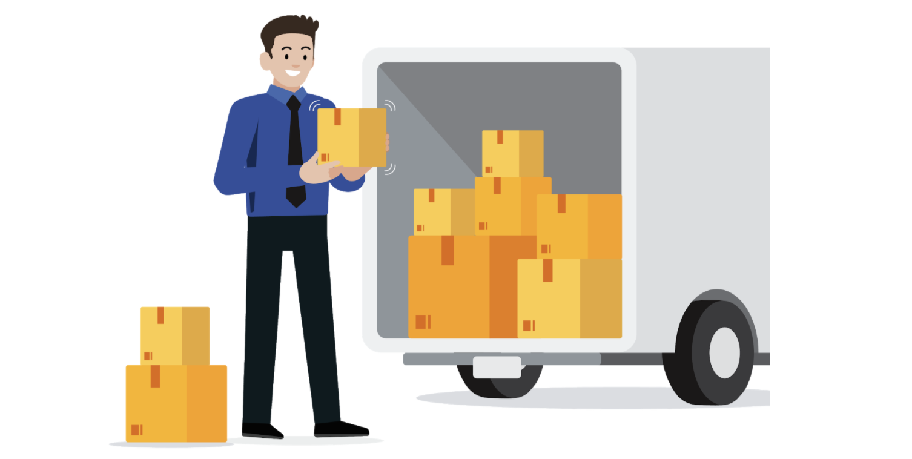

# Available R packages

To make the most of R for your data analysis, you will need to install packages. **Packages** are units of reproducible R code that you can use to add more functionality to R. The best part is that the R community creates and shares packages so that other users can access them! In this reading, you will learn more about widely used packages and where to find them.

Packages can be found in repositories, which are collections of useful packages that are ready to install. You can find repositories on [Bioconductor](http://bioconductor.org/), [R-Forge](https://r-forge.r-project.org/), [rOpenSci](https://ropensci.org/), or [GitHub](https://github.com/), but the most commonly used repository is the Comprehensive R Archive Network or [CRAN](https://cran.r-project.org/). CRAN stores code and documentation so that you can install packages into your own RStudio space.

## Package documentation

Packages will not only include the code itself, but also documentation that explains the package’s author, function, and any other packages that you will need to download. When you are using CRAN, you can find the package documentation in the DESCRIPTION file.

Check out Karl Broman's [R Package Primer](https://kbroman.org/pkg_primer/) to learn more.

## Choosing the right packages

With so many packages out there, it can be hard to know which ones will be the most useful for your library or directory of installed packages. Luckily, there are some great resources out there:

- [**Tidyverse**](https://www.tidyverse.org/): the tidyverse is a collection of R packages specifically designed for working with data. It’s a standard library for most data analysts, but you can also download the packages individually.
- [**Quick list of useful R packages**](https://support.rstudio.com/hc/en-us/articles/201057987-Quick-list-of-useful-R-packages): this is RStudio Support’s list of useful packages with installation instructions and functionality descriptions.
- [**CRAN Task Views**](https://cran.r-project.org/web/views/): this is an index of CRAN packages sorted by task. You can search for the type of task you need to perform and it will pull up a page with packages related to that task for you to explore.

You will discover more packages throughout this course and as you use R more often, but this is a great starting point for building your own library.