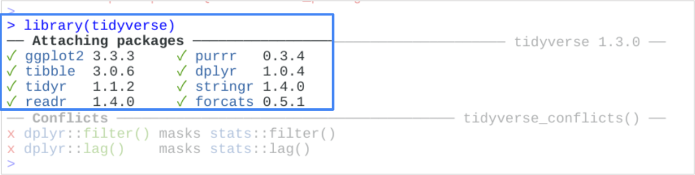

# Practice Quiz: Hands-On Activity: Installing and loading tidyverse

## Activity overview

In the last activity, you explored the R sandbox and used some R packages such as the tidyverse. In this activity, you’ll explore further with the tidyverse collection of packages and learn about them using the browseVignettes function.

By the end of this activity, you will know how to easily load vignettes. Moving forward, you can use the browseVignettes function to access and review included documentation to better understand each R package you will use.

### Install the tidyverse

If you have not yet installed the tidyverse, open RStudio.

Log in, navigate to the console, type install.packages("tidyverse"), and press Enter (Windows) or Return (Mac).

Then wait as RStudio installs the tidyverse packages (be patient, this can take a little bit). You’ll receive a message that the install is done.

```txt
installing *binary* package 'tidyverse'
*DONE (tidyverse)

The downloaded source packages are in
                    '/tmp/RtmpUCbADH/downloaded_packages'
>
```

### Load the tidyverse

Once the tidyverse packages have been installed, load them so that they are available in your current R session. Load the core tidyverse with the library command. The core tidyverse contains the main packages that work together to make your data analysis smooth and efficient.

To load the core tidyverse, type library(tidyverse) and press Enter (Windows) or Return (Mac).



### Read tidyverse vignettes

A **vignette** is documentation that acts as a guide to an R package. A vignette shares details about the problem that the package is designed to solve and how the included functions can help you solve it. The **browseVignettes** function allows you to read through vignettes of a loaded package.

To check out vignettes for one specific package, type `browseVignettes(“packagename”)` and press Enter (Windows) or Return (Mac). Remember that functions are case-sensitive in R, so “Vignettes” must have a capital V.

For example if you execute the `browseVignettes()` function on ggplot2, browseVignettes(“ggplot2”), you will have the following outcome:

## Reflection

In this activity, you explored the tidyverse package and learned about vignettes. In the text box below, write 2-3 sentences (40-60 words) in response to each of the following questions:

**How might the tidyverse and its packages help you as you learn how to program in R?**

**What impact will the browseVignettes function have on your analysis?**

I think that the tidyverse and its packages offer a structured and user-friendly approach to mastering data analysis tasks. These packages provide intuitive functions and consistent syntax, making it easier to understand and implement data manipulation techniques. By using tidyverse, beginners can build confidence in their programming skills and efficiently tackle real-world data analysis challenges.

The browseVignettes function is a valuable resource for new learners, allowing them to access comprehensive documentation and tutorials directly within RStudio. This functionality enables beginners to learn at their own pace, explore package functionalities, and gain insights into best practices for data analysis. By leveraging browseVignettes, new learners can accelerate their learning process, deepen their understanding of R packages, and develop proficiency in data analysis techniques.

> Correct
>
> Congratulations on completing this hands-on activity! A good response would include how using the tidyverse packages help you read, manipulate, visualize, and do many other important things with data.
>
> Tidyverse was designed to improve the overall workflow for analysts. Since the packages are all integrated with each other, your analysis will be more efficient. You can use the browseVignettes function to find out more about each package and how to use it.