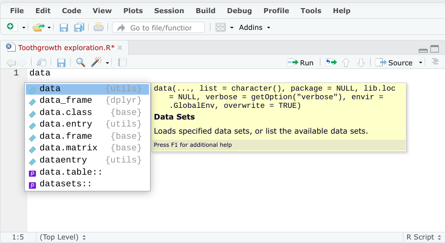
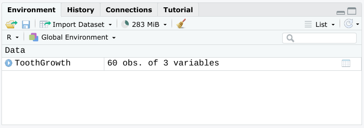

# Video: Working with tidyverse

## Question & Notes

- **Pipe** (R): A tool in R for expressing a sequence of multiple operations, represented with `%>%`
  - When using pipes:
    - Add the pipe operator at the end of each line of the piped operation except the last one
    - Check the code after had programmed the pipe
    - Revisit piped operations to chek for parts of your code to fix
- **Nested**: in programming, describes code that performs a particular function and is contained within code that performs a broader function
- **Nested function**: a function that is completely contained with another function

- Keyboard shortcuts:
  - Inserty pipe operator:
    - PC/Chromebook: `ctrl+shift+m`
    - Mac: `Commnad+shift+m`

### Issue 1: If you are following along with the video and receiving an error after running line 1, try the following

1. After typing the function name **data**, allow the dropdown menu to pop-up.

    

2. Make sure the top function titled "data" is highlighted in blue, and then press **ENTER**. Two parentheses will be automatically placed after the function, and type the rest of the syntax "`Toothgrowth`" between the parentheses. Then, click on the RUN button.

3. Notice that once the data has been loaded into memory, you will see the ToothGrowth item populate into the Data section on the right.

    

After the data has been successfully loaded, resume with the rest of the video, and be very careful to double check the syntax structure and placement of characters to avoid errors.

```R
## practice

data("ToothGrowth")
View(ToothGrowth)
install.packages("dplyr")

# Normal approach

filtered_tg <- filter(ToothGrowth, dose == 0.5)

View(filtered_tg)

arrange(filtered_tg, len)

## Nested function approach

arrange(filter(ToothGrowth, dose == 0.5), len)

## Pipe approach '%>%'
filtered_toothgr <- ToothGrowth %>%
  filter(dose == 0.5) %>%
  group_by(supp) %>%
  summarize(mean_len = mean(len, na.rm = T), .group = "drop")
arrange(len)
View(filtered_toothgr)

```

### Question 1: A nested function is a function contained within code that performs a broader function

- [ ] True
- [ ] False

> Correct: A nested function is a function contained within code that performs a broader function. The nested function performs its own specific function within the code.

### Question 2: Which of the following operators is the pipe operator?

- [x] %>%
- [ ] <-
- [ ] *
- [ ] !=

> Correct: The pipe operator is %>%. You can use it in R programming to call out a pipe to express a sequence of multiple operations.
