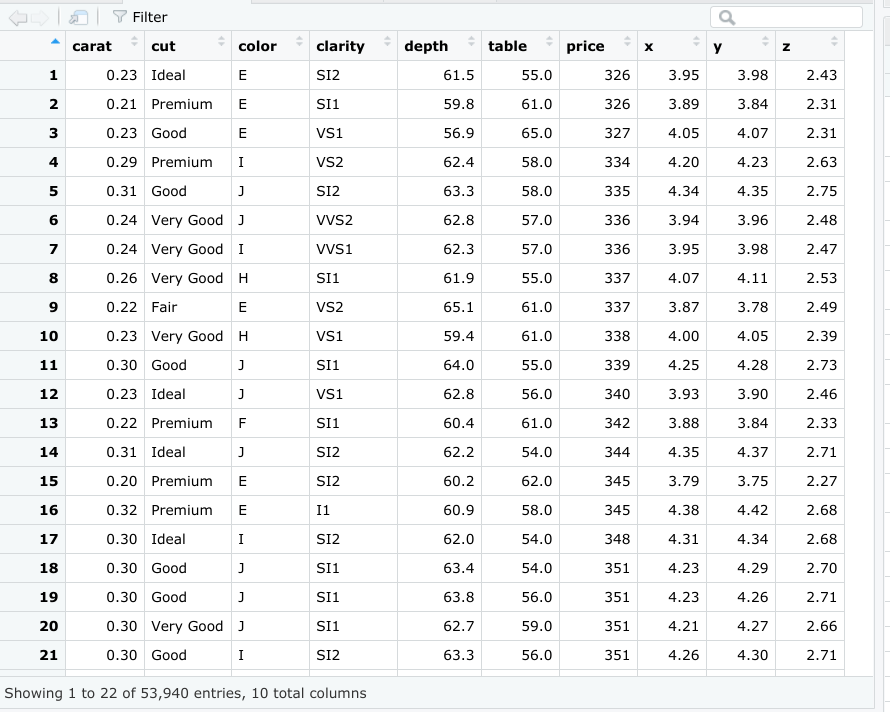

# Reading: More about tibbles

In this reading, you will learn about tibbles, which are a super useful tool for organizing data in R. You will get a review of what tibbles are, how they differ from standard data frames, and how to create them in R.


Tibbles are a little different from standard data frames. A data frame is a collection of columns, like a spreadsheet or a SQL table. Tibbles are like streamlined data frames that are automatically set to pull up only the first 10 rows of a dataset, and only as many columns as can fit on the screen. This is really useful when you’re working with large sets of data. Unlike data frames, tibbles never change the names of your variables, or the data types of your inputs. Overall, you can make more changes to data frames, but tibbles are easier to use. The tibble package is part of the core tidyverse. So, if you’ve already installed the tidyverse, you have what you need to start working with tibbles.

## Creating tibbles

Now, let’s go through an example of how to create a tibble in R. You can use the pre-loaded diamonds dataset that you’re familiar with from earlier videos. As a reminder, the diamonds dataset includes information about different diamond qualities, like carat, cut, color, clarity, and more.

You can load the dataset with the `data()` function using the following code:

```R
library(tidyverse) 

data(diamonds)
```

Then, let’s add the data frame to our data viewer in RStudio with the `View()` function.

```R
View(diamonds)
```

The dataset has 10 columns and thousands of rows. This image displays part of the data frame:



Now let’s create a tibble from the same dataset. You can create a tibble from existing data with the `as_tibble()` function. Indicate what data you’d like to use in the parentheses of the function. In this case, you will put the word “diamonds."

```R
as_tibble(diamonds)
```

## Results

When you run the function, you get a tibble of the diamonds dataset.


While RStudio’s built-in data frame tool returns thousands of rows in the diamonds dataset, the tibble only returns the first 10 rows in a neatly organized table. That makes it easier to view and print.

## Additional resources

For more information on tibbles, check out the following resources:

- The entry for [Tibble](https://tibble.tidyverse.org/) in the tidyverse documentation summarizes what a tibble is and how it works in R code. If you want a quick overview of the essentials, this is the place to go.

- The [Tidy chapter](https://rstudio-education.github.io/tidyverse-cookbook/tidy.html#) in "A Tidyverse Cookbook" is a great resource if you want to learn more about how to work with tibbles using R code. The chapter explores a variety of R functions that can help you create and transform tibbles to organize and tidy your data.

## **Key Points:**

- **Tibbles** are a streamlined version of standard data frames in R, automatically displaying only the first 10 rows and as many columns as fit on the screen.
- Unlike data frames, tibbles do not change variable names or data types and are easier to use.
- The **tibble** package is part of the core tidyverse, making it readily available if you have installed the tidyverse package.
- You can create a tibble from existing data frames using the `as_tibble()` function.
- The tidyverse documentation and "A Tidyverse Cookbook" provide additional resources for learning more about tibbles and their usage in R.
