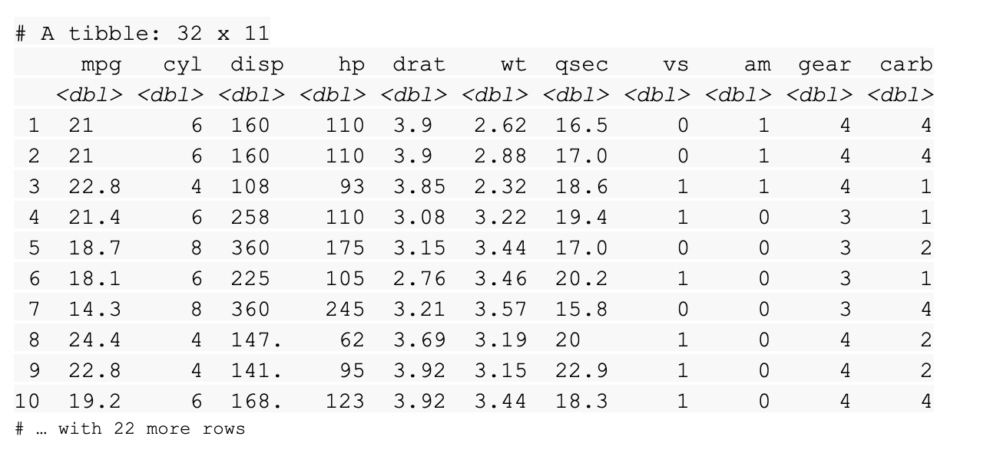

# Data-import basics

You can save this reading for future reference. Feel free to download a PDF version of this reading below:

## The `data()` function


The default installation of R comes with a number of preloaded datasets that you can practice with. This is a great way to develop your R skills and learn about some important data analysis functions. Plus, many online resources and tutorials use these sample datasets to teach coding concepts in R.

You can use the `data()` function to load these datasets in R. If you run the `data` function without an argument, R will display a list of the available datasets.

```R
data()
```

This includes the list of preloaded datasets from the datasets package.


If you want to load a specific dataset, just enter its name in the parentheses of the `data()` function. For example, let’s load the mtcars dataset, which has information about cars that have been featured in past issues of Motor Trend magazine.

```R
data(mtcars)
```

When you run the function, R will load the dataset. The dataset will also appear in the Environment pane of your RStudio. The Environment pane displays the names of the data objects, such as data frames and variables, that you have in your current workspace. In this image, `mtcars` appears in the fifth row of the pane. R tells us that it contains 32 observations and 11 variables.


Now that the dataset is loaded, you can get a preview of it in the R console pane. Just type its name...

```R
mtcars
```

...and then press `ctrl` (or `cmnd`) and `enter`.


You can also display the dataset by clicking directly on the name of the dataset in the Environment pane. So, if you click on `mtcars` in the Environment pane, R automatically runs the `View()` function and displays the dataset in the RStudio data viewer.


Try experimenting with other datasets in the list if you want some more practice.

## The `readr` package

In addition to using R’s built-in datasets, it is also helpful to import data from other sources to use for practice or analysis. The readr package in R is a great tool for reading rectangular data. Rectangular data is data that fits nicely inside a rectangle of rows and columns, with each column referring to a single variable and each row referring to a single observation.

Here are some examples of file types that store rectangular data:

- `.csv` (comma separated values): a .csv file is a plain text file that contains a list of data. They mostly use commas to separate (or delimit) data, but sometimes they use other characters, like semicolons.
- `.tsv` (tab separated values): a .tsv file stores a data table in which the columns of data are separated by tabs. For example, a database table or spreadsheet data.
- `.fwf` (fixed width files): a .fwf file has a specific format that allows for the saving of textual data in an organized fashion.
- `.log`: a .log file is a computer-generated file that records events from operating systems and other software programs.

Base R also has functions for reading files, but the equivalent functions in readr are typically much faster. They also produce tibbles, which are easy to use and read.

The readr package is part of the core tidyverse. So, if you’ve already installed the tidyverse, you have what you need to start working with readr. If not, you can install the tidyverse now.

## `readr` functions

The goal of readr is to provide a fast and friendly way to read rectangular data. readr supports several read_ functions. Each function refers to a specific file format.

- `read_csv()`: comma-separated values (.csv) files
- `read_tsv()`: tab-separated values files
- `read_delim()`: general delimited files
- `read_fwf()`: fixed-width files
- `read_table()`: tabular files where columns are separated by white-space
- `read_log()`: web log files

These functions all have similar syntax, so once you learn how to use one of them, you can apply your knowledge to the others. This reading will focus on the `read_csv()` function, since .csv files are one of the most common forms of data storage and you will work with them frequently.

In most cases, these functions will work automatically: you supply the path to a file, run the function, and you get a tibble that displays the data in the file. Behind the scenes, readr parses the overall file and specifies how each column should be converted from a character vector to the most appropriate data type.

## Reading a .csv file with readr

The readr package comes with some sample files from built-in datasets that you can use for example code. To list the sample files, you can run the `readr_example()` function with no arguments.

```R
readr_example()
```

This returns:

```txt
[1] "challenge.csv"     "epa78.txt"         "example.log"      
[4] "fwf-sample.txt"    "massey-rating.txt" "mtcars.csv"       
[7] "mtcars.csv.bz2"    "mtcars.csv.zip"
```

The “mtcars.csv” file refers to the mtcars dataset that was mentioned earlier. Let’s use the `read_csv()` function to read the “mtcars.csv” file, as an example. In the parentheses, you need to supply the path to the file. In this case, it’s `readr_example(“mtcars.csv”)`.

```R
read_csv(readr_example("mtcars.csv"))
```

When you run the function, R prints out a column specification that gives the name and type of each column.


R also prints a tibble.



## Optional: the `readxl` package

To import spreadsheet data into R, you can use the readxl package. The readxl package makes it easy to transfer data from Excel into R. Readxl supports both the legacy .xls file format and the modern xml-based .xlsx file format.

The readxl package is part of the tidyverse but is not a core tidyverse package, so you need to load readxl in R by using the library() function.  

## Reading an .xlsx file with readxl

Like the readr package, readxl comes with some sample

 files from built-in datasets that you can use for practice. You can run the code `readxl_example()` to see the list.  

You can use the `read_excel()` function to read a spreadsheet file just like you used `read_csv()` function to read a  .csv file. The code for reading the example file “type-me.xlsx” includes the path to the file in the parentheses of the function.  

```R
read_excel(readxl_example("type-me.xlsx"))
```

You can use the `excel_sheets()` function to list the names of the individual sheets.

```R
excel_sheets(readxl_example("type-me.xlsx"))
```

You can also specify a sheet by name or number.  Just type “sheet =” followed by the name or number of the sheet. For example, you can use the sheet named “numeric_coercion” from the list above.

```R
read_excel(readxl_example("type-me.xlsx"), sheet = "numeric_coercion")
```

When you run the function, R returns a tibble of the sheet.


## Additional resources

If you want to learn how to use readr functions to work with more complex files, check out the [Data Import chapter](https://r4ds.had.co.nz/data-import.html) of the R for Data Science book. It explores some of the common issues you might encounter when reading files, and how to use readr to manage those issues.

The [readxl entry](https://readxl.tidyverse.org/) in the tidyverse documentation gives a good overview of the basic functions in readxl, provides a detailed explanation of how the package operates and the coding concepts behind them, and offers links to other useful resources.

The R "datasets" package contains lots of useful preloaded datasets. Check out [The R Datasets Package](https://stat.ethz.ch/R-manual/R-devel/library/datasets/html/00Index.html) for a list. The list includes links to detailed descriptions of each dataset.

## **Key Points:**

- **Using the `data()` Function:**
  - The `data()` function loads preloaded datasets in R.
  - Running `data()` without arguments displays available datasets.
  - Specific datasets can be loaded by passing their names to the `data()` function.
  - Once loaded, datasets can be viewed in the Environment pane or by simply typing their names in the console.

- **The `readr` Package:**
  - The `readr` package in R is used for reading rectangular data.
  - It provides functions like `read_csv()` for reading CSV files and `read_tsv()` for tab-separated values files.
  - `readr` functions produce tibbles, which are easy to use and read.
  - The package is part of the core tidyverse and is efficient for reading large datasets.

- **Reading a .csv File with `readr`:**
  - Use `read_csv()` function to read CSV files.
  - Path to the file is supplied as an argument to `read_csv()`.
  - The function returns a tibble containing the data from the CSV file.

- **Optional: The `readxl` Package:**
  - The `readxl` package facilitates importing spreadsheet data from Excel into R.
  - It supports both .xls and .xlsx file formats.
  - Functions like `read_excel()` are used to read Excel files.
  - The package is not a core tidyverse package, so it needs to be loaded separately using `library(readxl)`.
