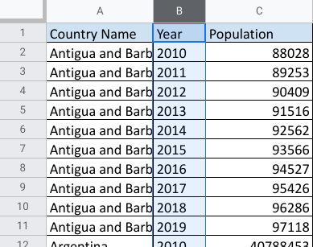

# Wide to long with tidyr

When organizing or tidying your data using R, you might need to convert wide data to long data or long to wide. Recall that this is what data looks like in a wide format spreadsheet:

Wide data has observations across several columns. Each column contains data from a different condition of the variable. In this example, the columns are different years.

Now check out the same data in a long format:

To review what you already learned about the difference, long data has all the observations in a single column, and the variable conditions are placed into separate rows.

## The `pivot_longer` and `pivot_wider` functions

There are compelling reasons to use both formats. But as an analyst, it is important to know how to tidy data when you need to. In R, you may have a data frame in a wide format that has several variables and conditions for each variable. It might feel a bit messy.

That’s where `pivot_longer()` comes in. As part of the tidyr package, you can use this R function to lengthen the data in a data frame by increasing the number of rows and decreasing the number of columns. Similarly, if you want to convert your data to have more columns and fewer rows, you would use the `pivot_wider()` function.

## Additional resources

To learn more about these two functions and how to apply them in your R programming, check out these resources:

- [Pivoting](https://tidyr.tidyverse.org/articles/pivot.html): Consider this a starting point for tidying data through wide and long conversions. This web page is taken directly from tidyr package information at tidyverse.org. It explores the components of the `pivot_longer` and `pivot_wider` functions using specific details, examples, and definitions.

- [CleanItUp 5: R-Ladies Sydney: Wide to Long to Wide to…PIVOT](https://rladiessydney.org/courses/ryouwithme/02-cleanitup-5/): This resource gives you additional details about the `pivot_longer` and `pivot_wider` functions. The examples provided use interesting datasets to illustrate how to convert data from wide to long and back to wide.

- [Plotting multiple variables](https://scc.ms.unimelb.edu.au/resources-list/simple-r-scripts-for-analysis/r-scripts): This resource explains how to visualize wide and long data, with ggplot2 to help tidy it. The focus is on using `pivot_longer` to restructure data and make similar plots of a number of variables at once. You can apply what you learn from the other resources here for a broader understanding of the pivot functions.
