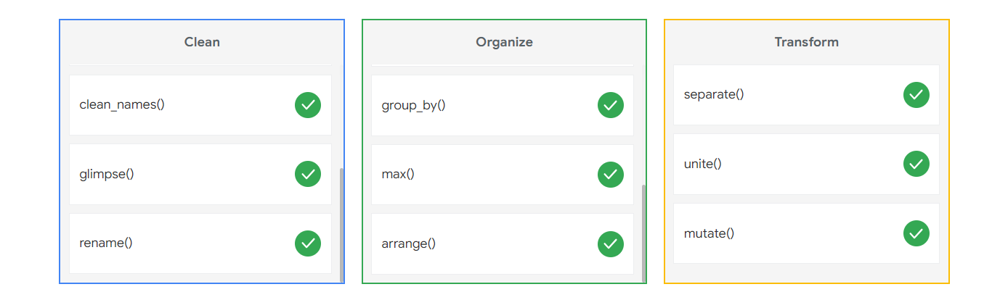

# Ungraded Plugin: Clean, organize, and transform data with R

## Categorization exercise: Using R functions

Clean, organize, and transform data with R

As a data analyst for a bicycle company, you’re training a new coworker on the best practices for using R. Categorize the commands to clean, organize, and transform data.

