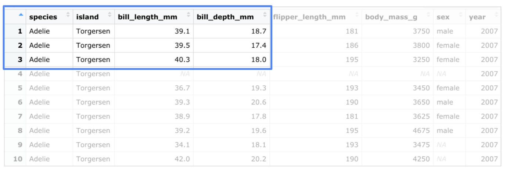
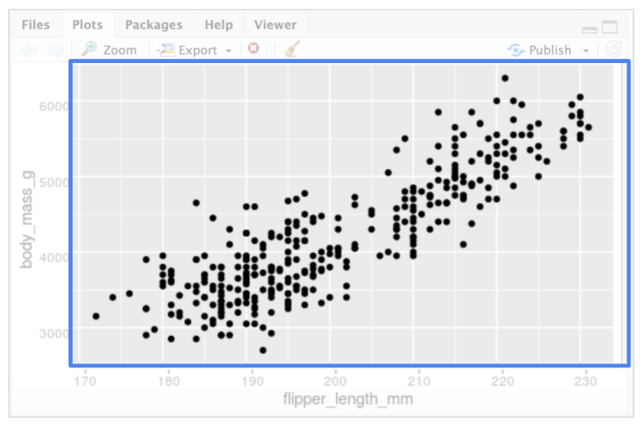

# Practice Quiz: Hands-On Activity: Visualizing data with ggplot2

## Activity Overview

Earlier in this course, you encountered ggplot2, an R package for data visualization. In this activity, you’ll learn about the basic logic of data visualization in ggplot2 and how to create a plot using R code.

By the time you complete this activity, you’ll be able to write R functions that create data visualizations. This will enable you to create basic visualizations to demonstrate and share findings with your data and code.

## The Basics of ggplot2

The ggplot2 package lets you make high-quality, customizable plots of your data. As a refresher, ggplot2 is based on the grammar of graphics, which is a system for describing and building data visualizations. The essential idea behind the grammar of graphics is that you can build any plot from the same basic components, like building blocks.

These building blocks include:

- A dataset
- A set of geoms: A geom refers to the geometric object used to represent your data. For example, you can use points to create a scatterplot, bars to create a bar chart, lines to create a line diagram, etc.
- A set of aesthetic attributes: An aesthetic is a visual property of an object in your plot. You can think of an aesthetic as a connection, or mapping, between a visual feature in your plot and a variable in your data. For example, in a scatterplot, aesthetics include things like the size, shape, color, or location (x-axis, y-axis) of your data points.

To create a plot with ggplot2, you first choose a dataset. Then, you determine how to visually organize your data on a coordinate system by choosing a geom to represent your data points and aesthetics to map your variables.

## Prepare Your Data

The `ggplot2` package lets you use R code to specify the dataset, geom, and aesthetics of your plot.

To do this, first choose a dataset to work with. For this activity, you will use the Palmer Penguins data that you’re already familiar with from earlier videos. However, you can also use another dataset instead.

Once you decide on your dataset, open RStudio and follow these steps:

1. If you have not done so before, use the `install.packages()` function to install both ggplot2 and the Palmer Penguins data set. Type `install.packages("ggplot2")` and `install.packages("palmerpenguins")`, then click Run.

2. Load ggplot2 and the dataset using the `library()` function. Type `library(ggplot2)` and `library(palmerpenguins)`.

3. Now, examine the data frame for the penguins data. To do this, use the `data()` and `View()` functions. Use a capital “V” for the `View()` function since functions in R are case sensitive. Type `data(penguins)` and `View(penguins)`, then click Run.

The first 10 rows of the data frame should appear like this:



The penguins dataset contains size measurements for three penguin species (Adelie, Chinstrap, and Gentoo) that live on the Palmer Archipelago in Antarctica. The columns include information such as body mass, flipper length, and bill length.

## Create a Plot in ggplot2

Suppose you want to plot the relationship between body mass and flipper length in the three penguin species. You can choose a specific geom that fits the type of data you have. Points show the relationship between two quantitative variables. A scatterplot of points would be an effective way to display the relationship between the two variables. You can put flipper length on the x-axis and body mass on the y-axis.

Type the following code to create the plot. But before you run it, review the code piece by piece:

```R
ggplot(data = penguins) + geom_point(mapping = aes(x = flipper_length_mm, y = body_mass_g))
```

- `ggplot(data = penguins)`: In ggplot2, you begin a plot with the `ggplot()` function. The `ggplot()` function creates a coordinate system that you can add layers to. The first argument of the `ggplot()` function is the dataset to use in the plot. In this case, it’s “penguins.”

- `+`: Then, you add a “+” symbol to add a new layer to your plot. You complete your plot by adding one or more layers to `ggplot()`.

- `geom_point()`: Next, you choose a geom by adding a geom function. The `geom_point()` function uses points to create scatterplots, the `geom_bar` function uses bars to create bar charts, and so on. In this case, choose the `geom_point` function to create a scatter plot of points. The ggplot2 package comes with many different geom functions. You’ll learn more about geoms later in this course.

- `(mapping = aes(x = flipper_length_mm, y = body_mass_g))`: Each geom function in ggplot2 takes a mapping argument. This defines how variables in your dataset are mapped to visual properties. The mapping argument is always paired with the `aes()` function. The `x` and `y` arguments of the `aes()` function specify which variables to map to the x-axis and the y-axis of the coordinate system. In this case, you want to map the variable “flipper_length_mm” to the x-axis, and the variable “body_mass_g” to the y-axis.

Now go ahead and run the code. When you do, you get the following plot:



The plot shows a positive relationship between the two variables. In other words, the larger the penguin, the longer the flipper.

Create Your Own Plot

To create your own plot using code, follow these three steps:

1. Start with the `ggplot()` function and choose a dataset to work with.

2. Add a `geom_` function to display your data.

3. Map the variables you want to plot in the arguments of the `aes()` function.

Try plotting with different datasets using different geoms and mapping arguments. Coming up in this course, you’ll learn even more about the process of creating a plot. You’ll also get a chance to work with the Penguins dataset to create lots of different plots in ggplot2.

Pro-Tip: You can write the same section of code above using a different syntax with the mapping argument inside the ggplot() call: `ggplot(data = penguins, mapping = aes(x = flipper_length_mm, y = body_mass_g)) +  geom_point()`

The ggplot2 Cheat Sheet

This is just the beginning of what you can do with ggplot2. If you want to find out more about ggplot2, RStudio has a useful reference guide called the “Data Visualization with ggplot2 Cheat Sheet.” You can use the Cheat Sheet as a quick reference while you work to learn about the main functions and features of ggplot2.

Click the link to check it out: [Cheat Sheet](https://rstudio.com/wp-content/uploads/2015/03/ggplot2-cheatsheet.pdf)

## **Confirmation**

In this activity, you created a scatterplot to show the relationship between flip

per length and body mass in three penguin species. Which part of your code refers to the geometric object used to represent your data?

- [ ] [+]
- [ ] `(mapping = aes(x = flipper_length_mm, y = body_mass_g))`
- [x] `geom_point()`
- [ ] `ggplot(data = penguins)`

> Correct: A geom is the geometric object used to represent your data. In this case, the function geom_point() tells R to represent your data with points.
