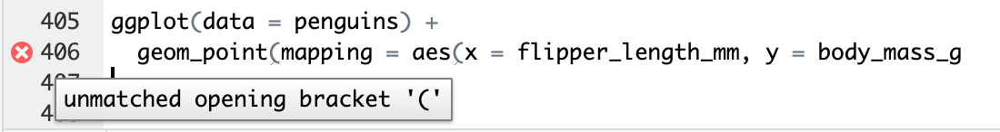
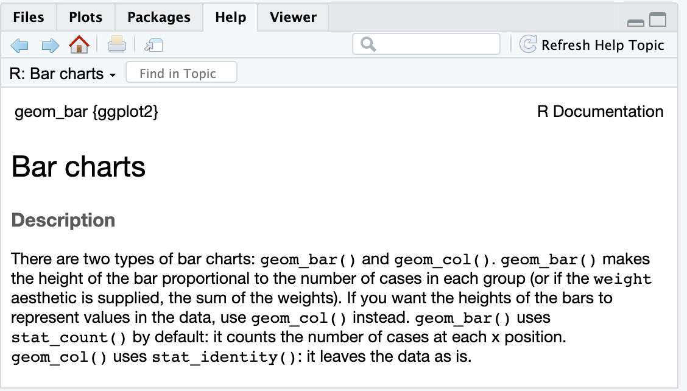

# Reading: Common problems when visualizing in R

You can save this reading for future reference. Feel free to download a PDF version of this reading below:

[common-problems-encountered-when-visualizing-in-R.pdf](./resources/common-problems-encountered-when-visualizing-in-R.pdf)

Coding errors are an inevitable part of writing code—especially when you are first beginning to learn a new programming language. In this reading, you will learn how to recognize common coding errors when creating visualizations using ggplot2. You will also find links to some resources that you can use to help address any coding problems you might encounter moving forward.

## Common coding errors in ggplot2

When working with R code in ggplot2, a lot of the most common coding errors involve issues with syntax, like misplaced characters. That is why paying attention to details is such an important part of writing code. When there is an error in your code that R is able to detect, it will generate an error message. Error messages can help point you in the right direction, but they won’t always help you figure out the precise problem.

Let’s explore a few of the most common coding errors you might encounter in ggplot2.

### Case sensitivity

R code is case sensitive. If you accidentally capitalize the first letter in a certain function, it might affect your code. Here is an example:

```R
Glimpse(penguins)
```

The error message lets you know that R cannot find a function named “Glimpse”:

```
Error in Glimpse(penguins) : could not find function "Glimpse"
```

But you know that the function `glimpse` (lowercase “g”) does exist. Notice that the error message doesn’t explain exactly what is wrong but does point you in a general direction.

Based on that, you can figure out that this is the correct code:

```R
glimpse(penguins)
```

### Balancing parentheses and quotation marks

Another common R coding error involves parentheses and quotation marks. In R, you need to make sure that every opening parenthesis in your function has a closing parenthesis, and every opening quotation mark has a closing quotation mark. For example, if you run the following code, nothing happens. R does not create the plot. That is because the second line of code is missing two closing parentheses:

```R
ggplot(data = penguins) + 
  geom_point(mapping = aes(x = flipper_length_mm, y = body_mass_g
```

RStudio does alert you to the problem. To the left of the line of code in your RStudio source editor, you might notice a red circle with a white “X” in the center. If you hover over the circle with your cursor, this message appears:



Here is the correct code:

```R
ggplot(data = penguins) + 
  geom_point(mapping = aes(x = flipper_length_mm, y = body_mass_g))
```

### Using the plus sign to add layers

In ggplot2, you need to add a plus sign (“+”) to your code when you add a new layer to your plot. Putting the plus sign in the wrong place is a common mistake. The plus sign should always be placed at the end of a line of code, and not at the beginning of a line.

Here’s an example of code that includes incorrect placement of the plus sign:

```R
ggplot(data = penguins) 
  + geom_point(mapping = aes(x = flipper_length_mm, y = body_mass_g))
```

In this case, R’s error message identifies the problem, and prompts you to correct it:

```r
Error: Cannot use `+.gg()` with a single argument. Did you accidentally put + on a new line?
```

Here is the correct code:

```R
ggplot(data = penguins) + 
  geom_point(mapping = aes(x = flipper_length_mm, y = body_mass_g))
```

You also might accidentally use a pipe instead of a plus sign to add a new layer to your plot, like this:

```R
ggplot(data = penguins)%>%   
  geom_point(mapping = aes(x = flipper_length_mm, y = body_mass_g))
```

You then get the following error message:

```r
Error: `data` must be a data frame, or other object coercible by `fortify()`, not an S3 object with class gg/ggplot
```

Here is the correct code:

```R
ggplot(data = penguins) + 
  geom_point(mapping = aes(x = flipper_length_mm, y = body_mass_g))
```

Keeping these issues in mind and paying attention to details when you write code will help you reduce errors and save time, so you can stay focused on your analysis.

## Help resources

Everyone makes mistakes when writing code—it is just part of the learning process. Fortunately, there are lots of helpful resources available in RStudio and online.

### R documentation

R has built-in documentation for all functions and packages. To learn more about any R function, just run the code `?function_name`. For example, if you want to learn more about the `geom_bar` function, type:

```R
?geom_bar
```

When you run the code, an entry on “geom_bar” appears in the Help viewer in the lower-right pane of your RStudio workspace. The entry begins with a “Description” section that discusses bar charts:



The [RDocumentation website](https://www.rdocumentation.org/) contains much of the same content in a slightly different format, with additional examples and links.

### ggplot2 documentation

The [ggplot2 page](https://ggplot2.tidyverse.org/), which is part of the official tidyverse documentation, is a great resource for all things related to ggplot2. It includes entries on key topics, useful examples of code, and links to other helpful resources.

### Online search

Doing an online search for the error message you are encountering (and including “R” and the function or package name in your search terms) is another option. There is a good chance someone else has already encountered the same error and posted about it online.

### The R community

If the other resources don’t help, you can try reaching out to the R community online. There are lots of useful online forums and websites where people ask for and receive help, including:

- [R for Data Science Online Learning Community](https://www.rfordatasci.com/)
- [RStudio Community](https://community.rstudio.com/)
- [Stackoverflow](http://stackoverflow.com/)
- [Twitter (#rstats)](https://twitter.com/hashtag/rstats?ref_src=twsrc%5Etfw%7Ctwcamp%5Etweetembed%7Ctwterm%5E1229486581620367361%7Ctwgr%5Eshare_3&ref_url=https%3A%2F%2Fwww.t4rstats.com%2F&src=hashtag_click)
