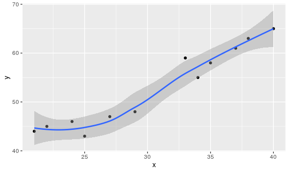
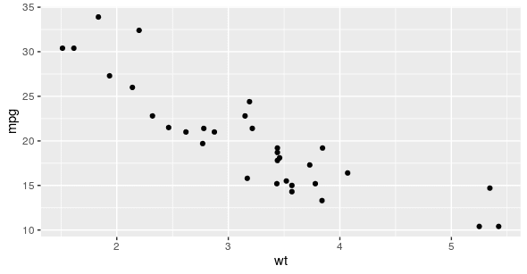
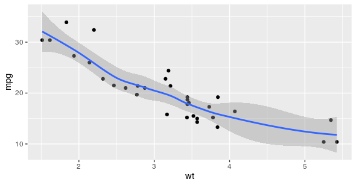

# Reading: Smoothing

In this reading, you will learn about smoothing in ggplot2 and how it can be used to make your data visualizations in R clearer and easier to follow. Sometimes it can be hard to understand trends in your data from scatter plots alone. Smoothing enables the detection of a data trend even when you can't easily notice a trend from the plotted data points. ggplot2’s smoothing functionality is helpful because it adds a smoothing line as another layer to a plot; the smoothing line helps the data to make sense to a casual observer.

## Example code

```R
ggplot(data, aes(x=distance, y=dep_delay)) +
    geom_point() +
    geom_smooth()
```

The example code creates a plot with a trend line similar to the blue line below.



## Two types of smoothing


| Type of smoothing | Description  | Example    |
|-------------------|--------------|------------|
| Loess smoothing   | The loess smoothing process is best for smoothing plots with less than 1000 points.   | `R ggplot(data, aes(x=, y=))+ geom_point() + geom_smooth(method="loess")`|
| Gam smoothing     | Gam smoothing, or generalized additive model smoothing, is useful for smoothing plots with a large number of points. | `R ggplot(data, aes(x=, y=)) + geom_point() + geom_smooth(method="gam", formula = y ~s(x))` |

The smoothing functionality in ggplot2 helps make data plots more readable, so you are better able to recognize data trends and make key insights. The first plot below is the data before smoothing, and the second plot below is the same data after smoothing.





## Key takeaways

- Smoothing helps data professionals reveal trends. When scatterplots alone lack clarity, smoothing adds a trend line, making underlying patterns in the data easier to spot for casual observers.
- ggplot2 offers two smoothing methods: Loess is best for plots with fewer than 1,000 points, it creates a flexible, local smoother. Gam is ideal for larger datasets because it uses a more robust model for general trends.
- Smoothing enhances data communication, adding a visual cue to highlight trends so data visualizations become clearer and more impactful for audiences.
