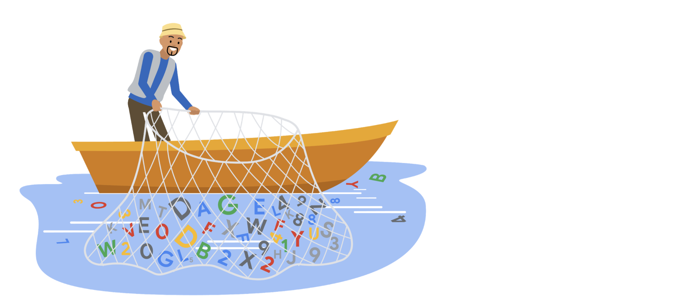

# Reading: Filtering and plots

By this point you have likely downloaded at least a few packages into your R library. The tools in some of these packages can actually be combined and used together to become even more useful. This reading will share a few resources that will teach you how to use the `filter` function from `dplyr` to make the plots you create with `ggplot2` easier to read.



## Example of filtering data for plotting

Filtering your data before you plot it allows you to focus on specific subsets of your data and gain more targeted insights. To do this, just include the `dplyr` `filter()` function in your `ggplot` syntax.

### Example code

```R
data %>%
    filter(variable1 == "DS") %>%  
    ggplot(aes(x = weight, y = variable2, colour = variable1)) +  
    geom_point(alpha = 0.3,  position = position_jitter()) + stat_smooth(method = "lm")
```

## Additional resources

To learn more details about `ggplot2` and filtering with `dplyr`, check out these resources:

- [**Putting it all together: (dplyr+ggplot)**](https://rladiessydney.org/courses/ryouwithme/03-vizwhiz-1/#1-4-putting-it-all-together-dplyr-ggplot)
  - The RLadies of Sydney’s course on R uses real data to demonstrate R functions. This lesson focuses specifically on combining `dplyr` and `ggplot` to filter data before plotting it. The instructional video will guide you through every step in the process while you follow along with the data they have provided.

- [**Data transformation:**](https://r4ds.had.co.nz/transform.html)
  - This resource focuses on how to use the `filter()` function in R, and demonstrates how to combine `filter()` with `ggplot()`. This is a useful resource if you are interested in learning more about how `filter()` can be used before plotting.

- [**Visualizing data with ggplot2:**](https://datacarpentry.org/dc_zurich/R-ecology/05-visualisation-ggplot2.html)
  - This comprehensive guide includes everything from the most basic uses for `ggplot2` to creating complicated visualizations. It includes the `filter()` function in most of the examples so you can learn how to implement it in R to create data visualizations.
