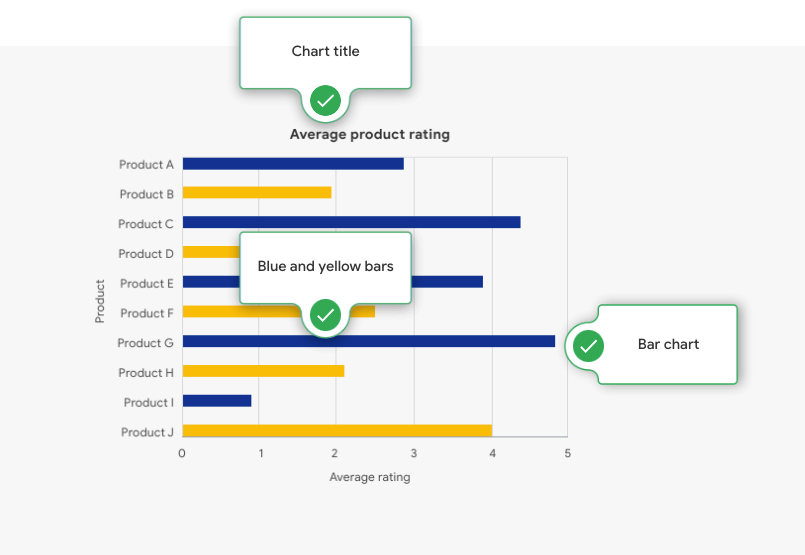
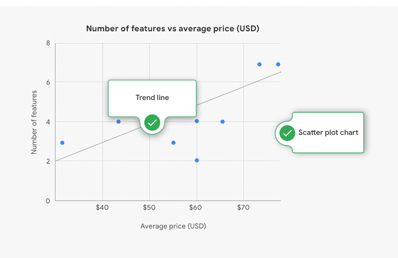
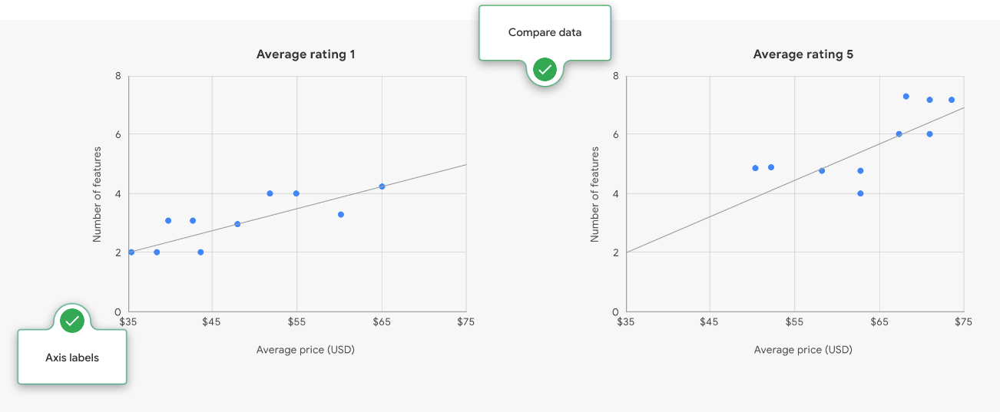

# Ungraded plugin: Elements of ggplot

## Data visualizations with ggplot

Interactive infographic

Know your ggplot functions

Select the label in each infographic to learn about the ggplot function that data analysts use to create visualizations.

### Bar chart

- **Chart title**: To add a title to the chart, use a label function: title = Average product rating.
- **Blue and yellow bars**: To highlight underperforming products, use an aesthetics function: col = ifelse (x<2, 'blue', 'yellow').
- **Bar chart**: To create the bars on the chart, use a geom function: geom_bar ().

### Scatter plot

- **Trend line**: To create a trend line, use a geom function: geom_smooth ().
- **Scatter plot chart**: To create the scatter plot, use a geom function: geom_point ().

### Compare data

- **Compare data**: To compare data trends across average ratings, use a facets function: facet_wrap (~Average Rating)
- **Axis labels**: To label the axes, use an aesthetics function: aes (x = Average price (USD), y = Product)
