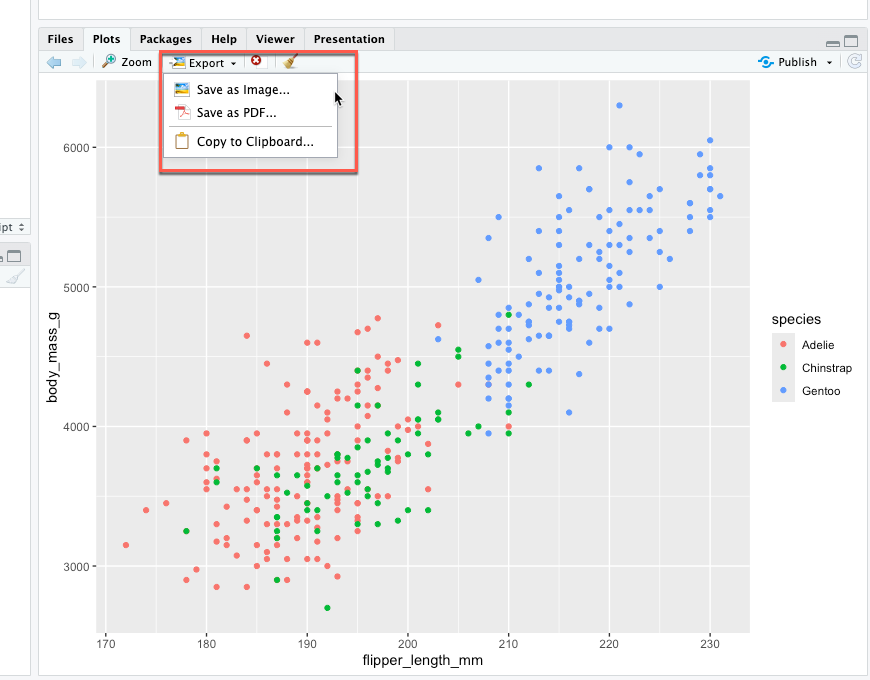

# Video: Saving your presentation

Video transcript

- Hi, and welcome back.
- In this video, we'll learn how to save our plots.
- Saving your work so that you can access it later is so important.
- It lets you continue to work on it yourself or share it with others.
- Being able to reproduce and share your work is a key part of your future analyst role because it lets you collaborate with teammates.
- They can double-check your work and offer feedback to help you improve it.
- So let's save our plots.
- To do this, you'll use the Export option in the plots tab of RStudio or the ggsave function provided by the ggplot2 package.
- First, we'll save our plots using the Export option.
- Then we'll use the ggsave function.
- Let's log into RStudio Cloud.
- We'll load the ggplot2 package and the penguins dataset.
- To start, let's write some code and create the plot that shows the relationship between body mass and flipper length in three penguin species.
- Let's use the Export option in the plots tab to save our plot.
- We can save it as an image file or a PDF file.
- Let's try saving it as an image.
- There are six different options for image format, including PNG and JPEG.
- Let's try PNG.
- Next, we name our file and click Save.
- Now, if we click on the files tab, we'll find our file in the list.
- Let's open it up.
- Looks great! That covers the export option for saving a plot.
- Now let's check out the ggsave function.
- Ggsave is a useful function for saving a plot.
- It defaults to saving the last plot that you displayed and uses the size of the current graphics device.
- Let's try saving our plot as a PNG file using ggsave.
- Ggsave will automatically save the plot that shows the relationship between body mass and flipper length because this is the last plot that we displayed.
- We have to give the file a name and say what kind of file we want to save it as.
- Let's write the code.
- Within the parentheses of the function we start off with a quotation mark, followed by the name of the file.
- Let's name it Three Penguin Species.
- We put a period after the file name, then the type of file we want, then a closing quotation mark.
- Let's run it.
- Now, if we click on the files tab, we'll find our new file in the list.
- Let's open it up.
- Again, looks great.
- That covers the basics of saving plots.
- After all your hard work creating plots in ggplot2, you definitely want to remember to save them so you can access and share them later on.
- That's the end of our work on data visualization.
- You're off to a great start visualizing data with ggplot2.
- Plus the concepts we've covered are a great base for learning even more about data viz in R as you move forward.
- We started off by learning the basic steps for creating plots in ggplot2.
- From there, we learned how aesthetics can change the look of our plots and highlight important parts of our data.
- We use different geoms to create different types of plots, like scatter plots and bar charts, and used facet functions to show subsets of our data.
- Then we customized our plots with labels and annotations.
- Finally, we learned how to save all our hard work so we can access and share it later on.
- That's a lot of ground we covered.
- Feel free to review the videos anytime you want and move at your own pace.
- It takes lots of time and practice to become familiar with new concepts and to develop new skills.
- No one gets everything right the first time around.
- But the more you practice, the more you'll start to feel at home in ggplot2.
- If it doesn't always feel easy, that's okay.
- That just means your mind is expanding and your skill set's getting bigger.
- Trust me, it's worth it.
- Learning ggplot2 is a game-changer for anyone interested in visualizing data.
- I hope you enjoyed it as much as I did.
- I love creating visuals in ggplot2.
- Coming up, you'll learn how to document and report your data using R.
- Until next time.

## Questions & Notes

- Export option
  - 

- ggsave() function

```r
library(ggplot2)
library(palmerpenguins)

# save the visualization

## export in RStudio
ggplot(data = penguins) +
  geom_point(mapping = aes(x = flipper_length_mm, y = body_mass_g, color =
                             species))

## ggsave() function of ggplot2
ggsave("three penguin species.png")
```

### Question 1: Where in RStudio can you find the export menu for saving plots?

- [x] The plots tab
- [ ] The source editor pane
- [ ] The R console pane
- [ ] The environment pane

> Correct: In RStudio, you can find the export menu for saving plots in the plots tab.

## My wrapper keypoints

1. **Importance of Saving Plots**: Saving plots is crucial for accessing and sharing your work later on. It allows you to continue working on your analysis, collaborate with teammates, and share your findings with others.

2. **Export Option in RStudio**: RStudio provides an Export option in the plots tab, allowing users to save plots as image files (e.g., PNG, JPEG) or PDF files. Users can choose the desired file format and specify a file name to save the plot.

3. **ggsave Function**: The `ggsave` function in ggplot2 is another method for saving plots. It defaults to saving the last plot displayed and uses the size of the current graphics device. Users can specify the file name, file type, and other parameters within the function.

4. **Saving Plots as Image Files**: Users can save plots as image files (e.g., PNG) using both the Export option in RStudio and the `ggsave` function. This allows them to preserve their visualizations for future reference or sharing.

5. **Accessing Saved Files**: After saving a plot, users can access the saved files from the files tab in RStudio. They can open the files to view the saved plots and verify that they were saved correctly.

6. **Review of Data Visualization Concepts**: The section concludes with a review of the key concepts covered in the data visualization tutorials, emphasizing the importance of practicing and reviewing the material at one's own pace.

7. **Encouragement for Learning**: The video encourages learners to continue practicing and exploring data visualization with ggplot2, acknowledging that mastery takes time and practice but is rewarding in the end.
