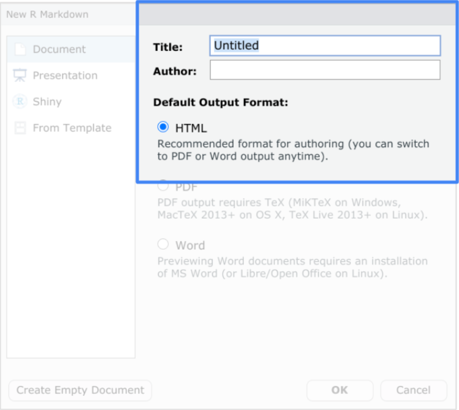
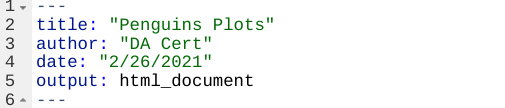
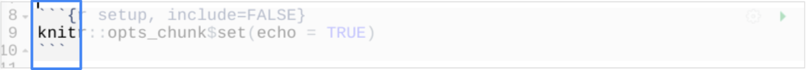
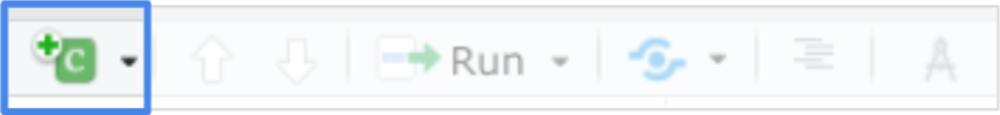
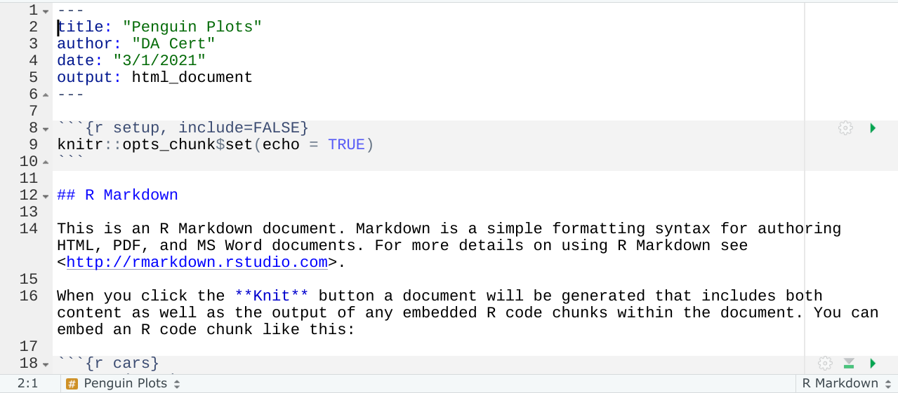
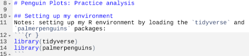
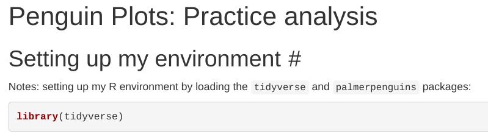
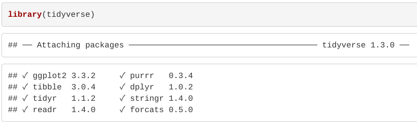

# Practice Quiz: Hands-On Activity: Your R Markdown notebook

## Activity overview

Earlier in this course, you worked on activities that were presented in an R Markdown (Rmd) file format. Data analysts use this file format to make dynamic documents—called notebooks—with R. In this activity, you’ll copy the analysis you did in a past activity into your own R Markdown notebook.

By the time you complete this activity, you will know how to create R Markdown documents to record your analysis in R. This will allow you to keep track of your data analysis process and share your work  with others.

## Get started with R Markdown

R Markdown is a file format for making dynamic documents with R. These documents, also known as notebooks, are records of analysis that help you, your team members, and stakeholders understand what you did in your analysis to reach your conclusions. You can publish a notebook as an html, pdf, or Word file, or in another format like a slideshow.

At any point during this activity, you can consult the [R Markdown Cheat Sheet](https://rstudio.com/wp-content/uploads/2015/02/rmarkdown-cheatsheet.pdf). This resource is a reference guide for all things R Markdown: from opening a file to publishing a final report of your analysis.

## Select and review your analysis

In this course, you’ve had the chance to practice and save files of your analysis in RStudio. To get started, open up an analysis that you have saved.

You can use **Open File** in the **File** menu.

Now, review the file you opened. Examine the data you pulled from and the functions you used to analyze it.

When you create an R Markdown notebook, you want to be able to share it with others so they can understand your process and conclusions. You may also want to keep it for your own records as a way to keep track of your progress using R for analysis.

## Open an Rmd file

Now, you’ll transfer the code from the file you opened to a new R Markdown file so that you can write your own explanation of the steps you took. By doing this, you can create a more complete record of your overall thought process so that others will be able to understand it.

1. Open a new R Markdown (Rmd) file to begin building the basic structure of your notebook. Select File -> New File -> R Markdown.

    

2. In the dialog box that opens, add a title for your notebook. Name it something that will help you easily recognize what your analysis is about (e.g., “Penguins Plots”).

3. Type your name in the Author field.

4. For now, leave the file in the recommended html output format. When you render the file later, it will appear as an html report. You can always change it to a pdf or Word file later.

5. Click OK. An R Markdown file will appear in a new tab in the script viewer pane. You should now have two tabs: one for the new Rmd file and one for your analysis. You can toggle back and forth between them when you need to by clicking on the tab you want to access.

## Format your notebook

The first part of your notebook is the YAML header section. YAML is a language used in data files to improve human readability, and the YAML header section exists to provide information about a document to the humans reading it. RStudio automatically populates this section with the information you provide and other general information, such as the date you create the file.



You can change the information in this section at any time by adding text or by typing over the current text. Notice that each line has a number associated with it. That makes it easy to reference a location in the notebook and also for you to track where you make changes in the notebook.

The next section with the gray background is a code chunk. You encountered these each time you ran a chunk of code during the activities in this course.



Again, RStudio automatically populates the notebook with this formatted default code chunk. This chunk basically means that your code will be shown in your final report when you’re ready to render it.

All code chunks begin and end with delimiters. To start a code chunk, you can type three tick marks followed by a lowercase “r” in curly brackets: ```{r}

To end it, type just the three tick marks: ```

There are two shortcuts to adding code. On your keyboard, you can press Ctrl + Alt + I (PC) or Cmd + Option + I (Mac). Or you can click the Add Chunk command in the editor toolbar:



To add a code chunk to your Rmd file, follow these steps:

1. Click the end of the last line of your Rmd file. Use either of the previously-mentioned shortcuts to create a code chunk.

2. Press Enter (Windows) or Return (Mac) two or three times after the default code chunk to create space between the existing code chunk and the next code chunk you will add.

3. Copy the code from the analysis file you opened earlier and paste it in the gray area between the beginning and ending delimiters.

4. Select the rest of the template content in the file and delete it. This gives you a blank space to work in to help avoid potential errors from mixing your own comments and code with the pre-existing ones in the template.

The white background is where you will type plain text with markdown syntax. As you learned earlier in this course, markdown is a syntax for formatting plain text files. Using



Here are some basic formatting options:

- To start a new paragraph, end a line with two spaces
- To apply italics to a word or phrase, place an asterisk at the beginning and at the end of the word or phrase, for example, *italics works*
- To apply bold to a word or phrase, place two asterisks at the beginning and at the end of the word or phrase, for example, **bold is useful**
- To create a header, type a hashtag (#) followed by a space and your text for example: # Getting Started with R Markdown

When creating headers keep the following in mind:

- Headers will appear in blue
- A single hashtag is the largest header
- The more hashtags you add (up to six), the smaller the header

To format comments in your notebook, follow these steps:

1. Click in a line above the code chunk you added but below the YAML section.

2. Type a main header for your report using a single hashtag. You might want to restate the title in the YAML in a different way or add to it with a short description.

3. Add a smaller header below that to label the first part of your programming. Follow that with a description of the code chunk that you added.



Tick marks format the text to appear as code even though the text is not in a code chunk. The tick marks in the code above create a gray background behind “tidyverse” and “palmerpenguins.”

## Continue formatting

Keep working on your formatting until you have at least three levels of headers and more descriptions for your analysis. At any point, you can click Knit in the script pane to render the file.

When you render your file, you can preview how it will look in the format you selected when you opened the file. In this example, you will preview an html file.



Rendering a file also automatically runs the code chunks to show the output. In this example, it shows that tidyverse was loaded using the library() function.



## Reflection

### Question 1: Suppose you include the header ## Conclusion in your R Markdown Notebook. How can you change this header to make it smaller?

- [x] Add another hashtag
- [ ] Remove a hashtag
- [ ] Add another space between the hashtags and the title
- [ ] Remove the space between the hashtags and the title

> Correct: To make a header smaller, add more hashtags before the title. For example, ### Conclusion would be smaller than ## Conclusion. Going forward, you can use R Markdown syntax to format your notebooks. This gives you creative freedom in how you want to present your analysis when you share it with others.

### Question 2: In this activity, you made your own R Markdown notebook. In the text box below, write 2-3 sentences (40-60 words) in response to each of the following questions:

- How can you make use of R Markdown notebooks in the future?
- What formatting did you use in this R Markdown notebook that will make it easier for others to understand your analysis?

R Markdown notebooks can be used in the future for documenting and sharing analysis processes, allowing for easy replication and understanding of the steps taken during data analysis. They serve as comprehensive records of analysis workflows and can be shared with team members, stakeholders, or for personal reference.

In the R Markdown notebook, I used markdown syntax for formatting, such as headers, bold and italic text, and code chunks. These formatting options help organize and structure the document, making it easier for others to navigate and comprehend the analysis steps and conclusions. Additionally, descriptive comments and explanations were provided alongside code chunks to provide context and insight into the analysis process.

> Correct: Congratulations on completing this hands-on activity! A good response would include that R Markdown notebooks are valuable resources for creating records and reports of your analysis in R and formatting your work to share with others.
>
> Creating an R Markdown notebook is a useful way to keep track of your analyses for your own purposes. You can also use notebooks to create final reports of your analysis to share with others. Going forward, you can take advantage of resources like the R Markdown Cheat Sheet to make your notebooks more effective tools.
