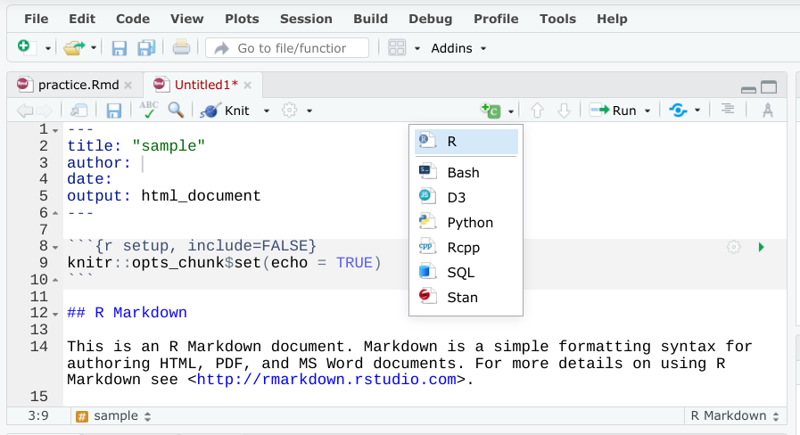

# Practice Quiz: Hands-On Activity: Adding code chunks to R Markdown notebooks

## Overview

Earlier in this course, you created a visualization using the ggplot() function. You also learned how to create an R Markdown notebook. In this activity, you will combine and apply your knowledge by adding the code you used to create a visualization to a RMarkdown notebook.

By the time you complete this activity, you will be able to make and format an .rmd file containing the visualizations you created using ggplot2. This will allow you to track and share analysis and also share the R code you use to create visualizations. This will prove useful if you want to give other data analysts an interactive way to test out your code and better communicate findings to your stakeholders and colleagues.

## Add code chunks to your RMarkdown notebook

1. To start, log in to your RStudio Cloud account.

2. Next, open a new R Markdown notebook and create a code block section. Notebook chunks can be inserted quickly using the keyboard shortcut Ctrl + Alt + I (Windows) or Cmd + Option + I (Mac). Code chunks can also be added using the Insert menu in the editor toolbar.

    

    Code chunks are designated in R Markdown with delimiters. A delimiter is a character that indicates the beginning or end of a data item. In this case, the code chunk is marked using three ticks followed by a curly bracket, descriptive text, and a closed curly bracket. You then have an empty space to add the appropriate code. Here is the general syntax:

    ```{r}

    ```

    When creating code chunks, it is useful to keep in mind that the output of the code chunk will appear immediately after the chunk when it is executed. Because of that, it is good practice to split chunks that produce multiple outputs into two or more chunks. That way, each code chunk only produces one output, which can be easier for users to execute and explore.

3. Using the code from your ggplot() visualization, create two new chunks. Type the following in the first code chunk to call the required libraries, load the penguins data, and return a view of the penguins data:

    ```{r ggplot for penguin data}

    library(ggplot2)

    library(palmerpenguins)

    data(penguins)

    View(penguins)

    ```

    Note that the only output from the code chunk is a tabular view of your data as result of the View function.

4. Then, type the following in the second code chunk to create the visualization:

    ```{r ggplot for penguin data visualization}

    ggplot(data = penguins) +

    geom_point(mapping = aes(x = flipper_length_mm, y = body_mass_g))

    ```

5. Finally, run each code chunk to examine the results. You might recognize this visualization from a [previous activity](../../module-4_more-about-visualizations-aesthetics-n-annotations/p1_create-data-visualizations-in-R/s3_pq_activity_visualizing-data-with-ggplot2.md).

Congratulations! You can now add your visualizations to an R Markdown notebook. Code chunks are a great way to explain your data analysis process and allow other users to explore your work. Try adding as many code chunks to your R Markdown notebook as possible to make your notebook an interactive experience.

## Confirmation and reflection

In R Markdown, you use delimiters--in this case, tick marks--to designate a code chunk. What would happen to your code chunk if you formatted it with two marks instead of three?

1 point

- [ ] It would appear as a code chunk but not be executable
- [ ] An error message would replace the chunk
- [ ] There would be no change
- [x] It would appear as regular non-code text

Question 2
In this activity, you created code chunks in an R Markdown file that will create visualizations with ggplot2. In the text box below, write 2-3 sentences (40-60 words) in response to each of the following questions:

- How does adding code chunks improve the usability of your R Markdown file?
- How does visualizing data in an R Markdown file differ from visualizing data in a program like Tableau?

> What do you think?
> Your answer cannot be more than 10000 characters.

### My reflection

In the R markdown document, along with explanatory text, the code chunks will give the sample code and output for the user to understand and imagine easily about the analysis process.
Compared to programs like Tableau, R Markdown provides a more integrated approach to data analysis. Combining code, visualizations, text, and other elements into a single document that is all in one place. On the other side, Tableau's powerful visualization capabilities, primarily focus on interactive dashboards and visualization, without incorporating code, documentation

> Correct: Congratulations on completing this hands-on activity!  A good response would include that visualizing with code chunks allows you to create data visualizations in the same document as text. This makes formatting reports much easier and simpler.

Adding code chunks to your R Markdown notebook can give other users an interactive way to understand your data analysis process and test out your code in their own RStudio console space. These can be useful for documenting your code and giving stakeholders a chance to explore the data.  
