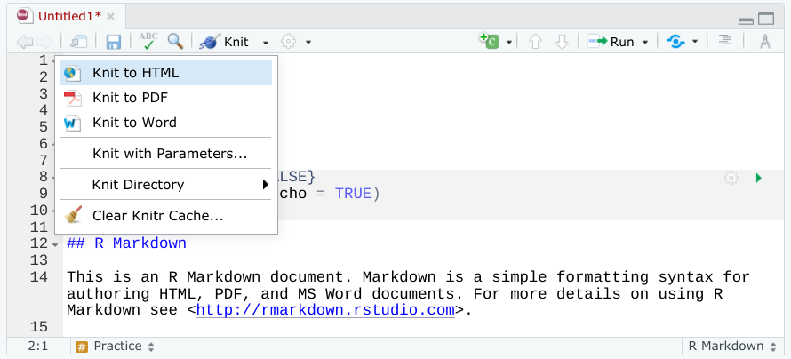
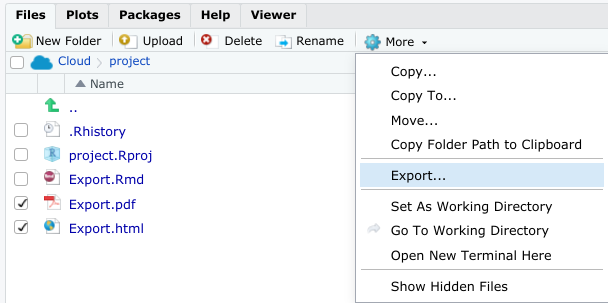
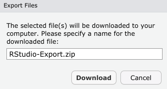

# Practice Quiz: Hands-On Activity: Exporting your R Markdown notebook

## Activity Overview

In the last activity, you created a draft of your R Markdown notebook. Now, you will export and share it.

By the time you complete this activity, you will be able to export an R notebook as two different outputs: html and pdf. This will enable you to easily share your work with others to get feedback and demonstrate your R skills.

## Export your R Markdown notebook

For this activity, you will export a notebook you created in previous activities as both an html document and a pdf.

You will use the Knit option to export your work. This will allow you to convert the Rmd file to another file type that is more readable and useful to other users.

To begin, follow these steps:

1. Open a document in [RStudio](https://rstudio.cloud/). Then, find the **Knit** button on the toolbar at the top of your document window. Click it to open a dropdown menu with a few export options.

2. Click on the option that matches the file type you want to export your notebook as. Begin with html. Once you click Knit to HTML, your console might take a moment to process. When it is finished, it will automatically open your new file.

    

3. Now, repeat Step 2 but select Knit to PDF. Explore how these file formats are different from your original Rmd file.

4. To download the files you exported, find them in the Files explorer in the bottom-right of the screen.

5. Check the boxes of the file(s) you want to download and click the More dropdown.

    

6. Click Export… and name the file by a title that will help you find it later. Click Download. Now your exported file will be downloaded to your computer.

    

After you have successfully exported and downloaded your R Markdown notebook, you can share it with a friend, colleague, or the discussion forums to get feedback. After you have gotten their feedback, you can make revisions and continue to share your work to refine your notebook even more.

Sharing your R Markdown notebook is a great way to give other users insights into your data analysis. R Markdown comes with a lot of different options for exporting notebooks, so you can choose the best file type for your needs.

Understanding how to export your R Markdown notebooks will make documenting and sharing your data analysis process easier. Now that you are familiar with this process, you can export your own notebooks for future projects.

## Confirmation and Reflection

When exporting an R Markdown file, which of the following file types can you Knit to? Select all that apply.

- [x] Word file
- [ ] jpg
- [x] pdf
- [x] html

> Correct: To export an Rmd file from RStudio, you can Knit the file to html, PDF, and Word file formats. This allows you to save, export, and download your R Markdown notebook in more accessible and readable formats that you can share in many professional settings.

### Question 2

In this activity, you exported an Rmd file as an html file and a pdf. In the text box below, write 2-3 sentences (40-60 words) in response to each of the following questions:

1. What is an advantage of exporting as an html file or a pdf? Is there a format you think you’ll use more often?

2. How do you plan to use or store the Rmd files you export?

When exporting an R Markdown file, you can Knit it to both HTML and PDF formats. These formats offer readability and portability, making it easier to share your work with others and maintain consistency across different platforms. Personally, I might lean towards using HTML more often due to its versatility and ease of accessibility across various devices and operating systems.

As for the Rmd files I export, I plan to use them for documentation, sharing insights with colleagues, and archiving my data analysis projects. Storing them in organized directories on my computer or cloud storage platforms will ensure easy access and retrieval whenever needed. Additionally, I may incorporate them into version control systems like Git for collaborative projects or future reference.

> Correct:
> Congratulations on completing this hands-on activity! A good response would include that R Markdown is a useful tool for documenting and sharing your analysis process. 
>
> Data analysts share their work in a variety of formats, such as pdfs, html files, and R Markdown notebooks. Understanding how to export or convert your work into any of these formats will help you be flexible in how you share it. As html files and pdfs, your work can be attached to emails or uploaded to a cloud-based file sharing platform like Google Drive. This also allows you to share your analysis with potential employers when you search for a job as a data analyst, which you will learn more about in a future course.
