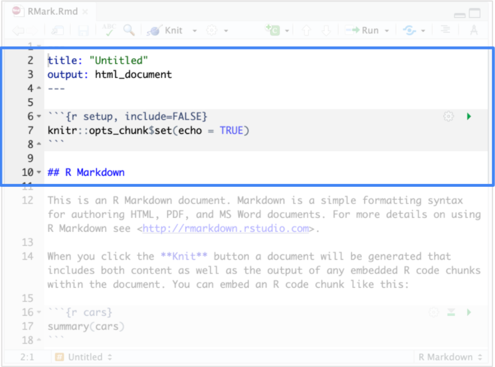
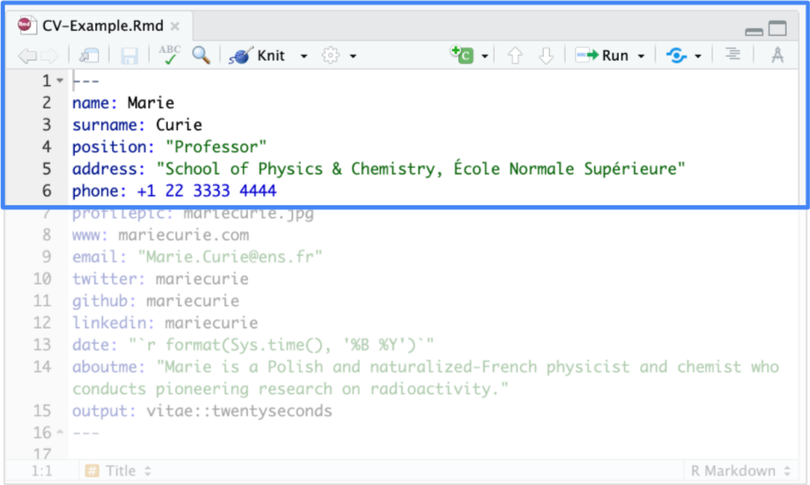
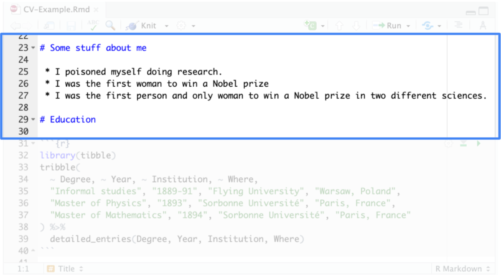
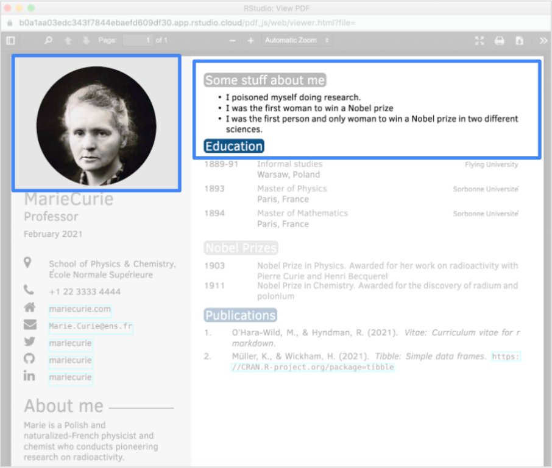

# Practice Quiz: Hands-On Activity: Using R Markdown templates
## Activity Overview

In previous activities, you used Rmd files to complete analyses and even created and exported your own. In this activity, you’ll learn how to access and use customized R Markdown templates included in R packages.

Templates allow you to use customized documents and there are lots of R packages that include custom templates for a variety of purposes. For example, there are templates for academic journal articles, for interactive presentations, or for vignettes summarizing the contents of R packages.

By the end of this activity, you will be able to adapt pre-existing templates to the needs of your projects. This will enable you to save time and energy while you set up an Rmd file and allow you to focus on your analysis.

## Example Template in RStudio

You’re already familiar with a template in R Markdown from earlier videos and activities. When you create a new R Markdown document from the RStudio menu (File -> New File -> R Markdown), a default example document appears in the RStudio source editor:

Many customized templates in R packages have a similar structure that includes a YAML header, code chunks, and text headers.

## R Packages with Templates

Some popular packages with templates for R Markdown include the following:

- The [**vitae**](https://github.com/mitchelloharawild/vitae) package contains templates for creating and maintaining a résumé or curriculum vitae (CV).
- The [**rticles**](https://github.com/rstudio/rticles) package provides templates for various journals and publishers.
- The [**learnr**](https://github.com/rstudio/learnr) package makes it easy to turn any R Markdown document into an interactive tutorial.
- The [**bookdown**](https://github.com/rstudio/bookdown) package facilitates writing books and long-form articles.
- The [**flexdashboard**](https://github.com/rstudio/flexdashboard) package lets you publish a group of related data visualizations as a dashboard.

## Access the CV Template in RStudio

To examine the CV template included in the “vitae” package, follow these steps:

1. First, log in to RStudio.
2. In the console, type `install.packages("vitae")` to install the vitae package.
3. Type `library(vitae)` to load the package.
4. You can access available templates in the R Markdown dialog box that appears when you create a new file. To create a new file in R Markdown, click File > New File > R Markdown.
5. From the R Markdown dialog box, click From Template to access a list of R Markdown templates provided by all installed packages.

    In the viewer, you may notice some template options from the vitae package: Curriculum Vitae (Awesome-CV format), Curriculum Vitae (Hyndman format), Curriculum Vitae (ModernCV format), etc. These are different types of CV templates.

6. Scroll down and click Curriculum Vitae (Twenty seconds format).
7. Add a name for the new file directory that will contain the files bundled in the template, such as “CV-Example.”
8. Finally, click OK.

## Convert the Template to PDF Format

The template will appear in the source editor pane. It contains a YAML header, code chunks, and text headers, just like the default example document that appears when you create a new R Markdown document. The example CV uses the scientist Marie Curie, the first woman to win a Nobel Prize (and the first person to win two Nobel Prizes). The YAML header contains entries for general information, such as name, address, phone number, and more.

If you scroll down, you’ll find header text that introduces separate sections for topics like personal information.

To display the output format of the template, click **Knit** to render the file. You don't need to open the dropdown menu to select a format, as this template defaults to a pdf.

**Note**: If your browser blocks pop-ups and returns an error, make sure to click **Try Again**.

This will result in a pdf that displays the custom template for the CV.

This pdf can be found and downloaded from the folder in the Files tab of the lower-right console.

The information in the YAML Header appears on the left side, and the information in the various sections appears on the right side.

You can replace these details with your own information to adapt the template for your own needs.

## Confirmation and Reflection

Which of the following kinds of information can you include in this CV template? Select all that apply.

- [x] Email address
- [ ] Instagram username
- [x] Profile picture
- [x] Twitter username

> Correct: The template you used in this activity allows you to input an email address, profile picture, and Twitter username. You can replace the information in the template with your own to create a CV. Going forward, you can use R Markdown templates to start your documents with a pre-existing structure--leaving you with more time to focus on your content and analysis.

### Question 2

In this activity, you used an R package to open a Markdown template and edited it with your own information. In the text box below, write 2-3 sentences (40-60 words) in response to the following question:

How might you use R Markdown templates in your future analysis?

> Correct: Congratulations on completing this hands-on activity! A good response would include that R Markdown templates are a great resource for customizing your documentation.
>
> You can use R Markdown templates for lots of different purposes. Exploring a variety of packages with unique templates will help you figure out which ones you might use to document your own analysis and conclusions. You can use R templates as starting points for reports, portfolio pieces, and other documents you will create in your career as a data analyst.
