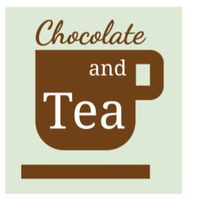

# Course 7 challenge

## 1. Scenario 1, questions 1-7

As part of the data science team at Gourmet Analytics, you use data analytics to advise companies in the food industry. You clean, organize, and visualize data to arrive at insights that will benefit your clients. As a member of a collaborative team, sharing your analysis with others is an important part of your job.

Your current client is Chocolate and Tea, an up-and-coming chain of cafes.



The eatery combines an extensive menu of fine teas with chocolate bars from around the world. Their diverse selection includes everything from plantain milk chocolate, to tangerine white chocolate, to dark chocolate with pistachio and fig. The encyclopedic list of chocolate bars is the basis of Chocolate and Tea’s brand appeal. Chocolate bar sales are the main driver of revenue.

Chocolate and Tea aims to serve chocolate bars that are highly rated by professional critics. They also continually adjust the menu to make sure it reflects the global diversity of chocolate production. The management team regularly updates the chocolate bar list in order to align with the latest ratings and to ensure that the list contains bars from a variety of countries.

They’ve asked you to collect and analyze data on the latest chocolate ratings. In particular, they’d like to know which countries produce the highest-rated bars of super dark chocolate (a high percentage of cocoa). This data will help them create their next chocolate bar menu.

Your team has received a dataset that features the latest ratings for thousands of chocolates from around the world. Click [here](https://www.kaggle.com/rtatman/chocolate-bar-ratings) to access the dataset OR download [here](./resources/flavors_of_cacao.csv). Given the data and the nature of the work you will do for your client, your team agrees to use R for this project.

### Quetion: You create a short document about the benefits of using R for the project and share the document with your team. You write that the benefits include R’s ability to quickly process lots of data and easily reproduce and share an analysis. What is another benefit of using R for the project?

- [ ] Choose a topic for analysis
- [x] Create high-quality visualizations
- [ ] Automatically clean data
- [ ] Define a problem and ask the right questions

> Correct
Another benefit of using R for the project is R’s ability to create high-quality data visualizations.

## 2. Scenario 1, continued

Before you begin working with your data, you need to import it and save it as a data frame. To get started, you open your RStudio workspace and load the tidyverse library. You upload a .csv file containing the data to RStudio and store it in a project folder named flavors_of_cacao.csv.

### Question: You use the read_csv() function to import the data from the .csv file. Assume that the name of the data frame is chocolate_df and the .csv file is in the working directory. What code chunk lets you create the data frame?  

- [ ] chocolate_df  <- "flavors_of_cacao.csv"(read_csv)
- [ ] read_csv("flavors_of_cacao.csv") + chocolate_df
- [ ] chocolate_df + read_csv("flavors_of_cacao.csv")
- [x] chocolate_df <-read_csv("flavors_of_cacao.csv")

> Correct: The code chunk chocolate_df <-read_csv("flavors_of_cacao.csv") lets you create the data frame. In this code chunk:
>
> - chocolate_df is the name of the data frame that will store the data.
> - <- is the assignment operator to assign values to the data frame.
> - read_csv() is the function that will import the data to the data frame.
> -"flavors_of_cacao.csv" is the file name that read.csv() function takes for its argument.

## 3. Scenario 1, continued

Now that you’ve created a data frame, you want to find out more about how the data is organized. The data frame has hundreds of rows and lots of columns.

Assume the name of your data frame is flavors_df. What code chunk lets you review the column names in the data frame?

- [ ] col(flavors_df)
- [x] colnames(flavors_df)
- [ ] arrange(flavors_df)
- [ ] rename(flavors_df)

> Correct: You write the code chunk colnames(flavors_df). In this code chunk:
>
> - colnames() is the function that will let you review the column names in the data frame.
> - flavors_df is the name of the data frame that the colnames() function takes for its argument.

## 4. Scenario 1, continued

Next, you begin to clean your data. When you check out the column headings in your data frame you notice that the first column is named Company...Maker.if.known. (Note: The period after known is part of the variable name.) For the sake of clarity and consistency, you decide to rename this column Brand (without a period at the end).

Assume the first part of your code chunk is:

`flavors_df %>%`

What code chunk do you add to change the column name?

- [ ] rename(Company...Maker.if.known. , Brand)
- [x] rename(Brand = Company...Maker.if.known.)
- [ ] rename(Company...Maker.if.known. = Brand)
- [ ] rename(Brand, Company...Maker.if.known.)

> Correct: You write the code chunk rename(Brand = Company...Maker.if.known.).
>
> In this code chunk:
>
> - rename() is the function that will change the name of your column.
> - Inside the parentheses of the function, write the new name (Brand), then an equals sign, then the name you want to change (Company...Maker.if.known.).

## 4. Question 5

After previewing and cleaning your data, you determine what variables are most relevant to your analysis. Your main focus is on Rating, Cocoa.Percent, and Company. You decide to use the select() function to create a new data frame with only these three variables.

Assume the first part of your code is:

trimmed_flavors_df <- flavors_df %>%

Add the code chunk that lets you select the three variables.

```R
    select(Rating, `Cocoa.Percent`, `Company`)
```

What company appears in row 1 of your tibble?

- [ ] Soma
- [x] A. Morin
- [ ] Rogue
- [ ] Videri

> Correct: You add the code chunk select(Rating, Cocoa.Percent, Company) to select the three variables. The correct code is trimmed_flavors_df <- flavors_df %>% select(Rating, Cocoa.Percent, Company). In this code chunk:
>
> - The select() function lets you select specific variables for your new data frame.
> - select() takes the names of the variables you want to choose as its argument: Rating, Cocoa.Percent, Company.
>
> The company A. Morin appears in row 1 of your tibble.

## 6. Question 6

Next, you select the basic statistics that can help your team better understand the ratings system in your data.

Assume the first part of your code is:

`trimmed_flavors_df %>%`

You want to use the summarize() and mean() functions to find the mean rating for your data. Add the code chunk that lets you find the mean value for the variable Rating.

```R
summarize(mean_rating = mean(Rating))
```
  
What is the mean rating?

- [ ] 4.230765
- [ ] 3.995445
- [x] 3.185933
- [ ] 4.701337

> Correct: You add the code chunk summarize(mean(Rating)) to find the mean value for the variable Rating. The correct code is trimmed_flavors_df %>% summarize(mean(Rating)). In this code chunk:
>
> - The summarize() function lets you display summary statistics. You can use the summarize() function in combination with other functions such as mean(), sd(), and max() to calculate specific statistics.
> - In this case, you use mean() to calculate the mean value for the variable Rating.
>
> The mean rating is 3.185933.

## 7. Question 7: After completing your analysis of the rating system, you determine that any rating greater than or equal to 3.5 points can be considered a high rating. You also know that Chocolate and Tea considers a bar to be super dark chocolate if the bar's cocoa percent is greater than or equal to 70%. You decide to create a new data frame to find out which chocolate bars meet these two conditions

Assume the first part of your code is:

`best_trimmed_flavors_df <- trimmed_flavors_df %>%`

You want to apply the filter() function to the variables Cocoa.Percent and Rating. Add the code chunk that lets you filter the data frame for chocolate bars that contain at least 70% cocoa and have a rating of at least 3.5 points.

What rating appears in row 1 of your tibble?

- [ ] 4.25
- [x] 3.50
- [ ] 4.00
- [ ] 3.75

## 8. Question 8: Now that you’ve cleaned and organized your data, you’re ready to create some useful data visualizations. Your team assigns you the task of creating a series of visualizations based on requests from the Chocolate and Tea management team. You decide to use ggplot2 to create your visuals

Assume your first line of code is:

`ggplot(data = best_trimmed_flavors_df) +`

You want to use the geom_bar() function to create a bar chart. Add the code chunk that lets you create a bar chart with the variable Company on the x-axis.

How many bars does your bar chart display?

- [ ] 6
- [x] 8
- [ ] 10
- [ ] 4

> Correct: You add the code chunk geom_bar(mapping = aes(x = Company)) to create a bar chart with the variable Company on the x-axis. The correct code is ggplot(data = best_trimmed_flavors_df) + geom_bar(mapping = aes(x = Company)). In this code chunk:
>
> - geom_bar() is the geom function that uses bars to create a bar chart.
>
> - Inside the parentheses of the aes() function, the code x = Company maps the x aesthetic to the variable Company.
>
> - Company will appear on the x-axis of the plot.
>
> - By default, R will put a count of the variable Company on the y-axis.
>
> Your bar chart displays 8 bars.

## 9. Question 9: Your bar chart reveals the locations that produce the highest rated chocolate bars. To get a better idea of the specific rating for each location, you’d like to highlight each bar

Assume that you are working with the following code:

```r
    ggplot(data = best_trimmed_flavors_df) +
    geom_bar(mapping = aes(x = Company.Location))
```

Add a code chunk to the second line of code to map the aesthetic fill to the variable Rating.

NOTE: the three dots (...) indicate where to add the code chunk.

`geom_bar(mapping = aes(x = Company.Location, fill=Rating))`

According to your bar chart, which two company locations produce the highest rated chocolate bars?

- [x] Canada and France
- [ ] Scotland and U.S.A.
- [ ] Amsterdam and France
- [ ] Scotland and Canada

> Correct: You add the code chunk fill = Rating to the second line of code to map the aesthetic fill to the variable Rating. The correct code is ggplot(data = best_trimmed_flavors_df) + geom_bar(mapping = aes(x = Company.Location, fill = Rating)). In this code chunk:
>
> - Inside the parentheses of the aes() function, after the comma that follows x = Company.Location, write the aesthetic (fill), then an equals sign, then the variable (Rating).
>
> - The specific rating of each location will appear as a specific color inside each bar of your bar chart.
>
>On your visualization, the legend titled "Rating" shows the color coding for the variable Rating. Lighter blues correspond to higher ratings and darker blues correspond to lower ratings.
>
>According to your bar chart, the two company locations that produce the highest rated chocolate bars are Canada and France.

## 10. Scenario 2, continued

A teammate creates a new plot based on the chocolate bar data. The teammate asks you to make some revisions to their code.

Assume your teammate shares the following code chunk:

```r
    ggplot(data = best_trimmed_flavors_df) +
    geom_bar(mapping = aes(x = Company)) +
```

What code chunk do you add to the third line to create wrap around facets of the variable Company?

- [ ] facet_wrap(=Company)
- [ ] facet(Company)
- [ ] facet_wrap(+Company)
- [ ] facet_wrap(~Company)

> Correct: You write the code chunk facet_wrap(~Company). In this code chunk:
>
> - facet_wrap() is the function that lets you create wrap around facets of a variable.
> - Inside the parentheses of the facet_wrap() function, type a tilde symbol (~) followed by the name of the variable (Company).

## 11. Scenario 2, continued

Your team has created some basic visualizations to explore different aspects of the chocolate bar data. You’ve volunteered to add titles to the plots. You begin with a scatterplot.

Assume the first part of your code chunk is:

```r
    ggplot(data = trimmed_flavors_df) +
    geom_point(mapping = aes(x = Cocoa.Percent, y = Rating)) +
```

What code chunk do you add to the third line to add the title Best Chocolates to your plot?

- [ ] labs(title <- "Best Chocolates")
- [x] labs(title = “Best Chocolates”)
- [ ] labs("Best Chocolates" = title)
- [ ] labs("Best Chocolates")

> Correct: You write the code chunk labs(title = “Best Chocolates”). In this code chunk:
>
> - labs() is the function that lets you add a title to your plot.
> - In the parentheses of the labs() function, write the word title, then an equals sign, then the specific text of the title in quotation marks (“Best Chocolates”).

## 12. Scenario 2, continued

Next, you create a new scatterplot to explore the relationship between different variables. You want to save your plot so you can access it later on. You know that the ggsave() function defaults to saving the last plot that you displayed in RStudio, so you’re ready to write the code to save your scatterplot.  

Assume your first two lines of code are:

```r
ggplot(data = trimmed_flavors_df) +
geom_point(mapping = aes(x = Cocoa.Percent, y = Rating)) +
```

What code chunk do you add to the third line to save your plot as a jpeg file with chocolate as the file name?

- [ ] ggsave(chocolate.jpeg)
- [ ] ggsave(“jpeg.chocolate”)
- [ ] ggsave(“chocolate.png”)
- [x] ggsave(“chocolate.jpeg”)

> Correct: You add the code chunk ggsave(“chocolate.jpeg”) to save your plot as a jpeg file with “chocolate” as the file name. In this code chunk:
>
> - Inside the parentheses of the ggsave() function, type a quotation mark followed by the file name (chocolate), then a period, then the type of file format (jpeg), then a closing quotation mark.

## 13. Scenario 2, continued

As a final step in the analysis process, you create a report to document and share your work. Before you share your work with the management team at Chocolate and Tea, you are going to meet with your team and get feedback. Your team wants the documentation to include all your code and display all your visualizations.

You want to record and share every step of your analysis, let teammates run your code, and display your visualizations. What do you use to document your work?

- [ ] A spreadsheet
- [x] An R Markdown notebook
- [ ] A database
- [ ] A data frame

> Correct: You use an R Markdown notebook to document your work. The notebook lets you record and share every step of your analysis, lets your teammates run your code, and displays your visualizations.
