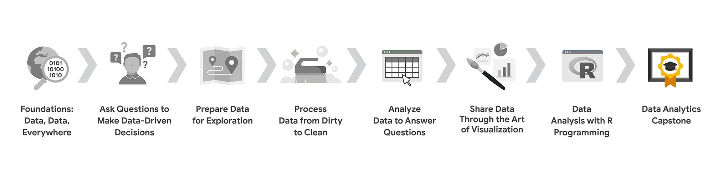

# Course 8 Overview: Set Your Expectations

- [Foundations: Data, Data, Everywhere](../../../1_Foundations_Data-Data-Everywhere/readme_course-1.md)
- [Ask Questions to Make Data-Driven Decisions](../../../2_Ask-Questions-to-Make-Data-Driven-Decisions/readme_course-2.md)
- [Prepare Data for Exploration](../../../3_Prepare-Data-for-Exploration/readme_course-3.md)
- [Process Data from Dirty to Clean](../../../4_Process-Data-from-Dirty-to-Clean/readme_course-4.md)
- [Analyze Data to Answer Questions](../../../5_Analyze-Data-to-Answer-Questions/readme_course-5.md)
- [Share Data through the Art of Visualization](../../../6_Share-Data-Through-the-Art-of-Visualization/readme_course-6.md)
- [Data Analysis with R Programming](../../readme_course-7.md)
- [**Google Data Analytics Capstone: Complete a Case Study(this course)**](../../../8_Google-Data-Analytics-Capstone_Complete-a-Case-Study/readme_course-8.md)

You are approaching the last leg of your journey: the eighth and final course! You have gained the knowledge and job-ready skills to work as an entry-level data analyst. Through video vignettes, readings, journal entries, hands-on activities, online discussions, and networking with other learners, you now know what it takes to analyze and process data. You can find key insights and solve business problems using data.

To recap the highlights of your journey, you:

- Discovered data analysis, data analytics, and data ecosystems, and how data is used in organizational decision-making
- Learned how to ask SMART questions to make data-driven decisions, use spreadsheets, and work effectively with stakeholders
- Explored analytical thinking skills, the data analysis process, and the use of spreadsheets, SQL, and data visualizations as core data tools
- Practiced cleaning data in spreadsheets and SQL databases, and learned how important it is to verify, document, and report the cleaning process to ensure data integrity
- Organized, sorted, filtered, and aggregated data for analysis, and performed basic calculations with functions and formulas in spreadsheets, and SQL queries and temporary tables in databases
- Learned about design thinking, created visualizations and dashboards in Tableau, and worked on your communication skills to present engaging data-driven stories
- Wrote code in the R programming language to clean and analyze data, used RStudio to edit and run your code, and created detailed data visualizations in RStudio

## What to expect

The Google Data Analytics Certificate Capstone Project is an opportunity for you to use many of the skills and competencies you gained from earlier courses. You have already invested many weeks in the program, so completing this capstone project is like a grand celebration of your learning achievements! The Capstone Project is optional, and choosing whether or not to complete it will not affect your ability to receive your certificate. However, it is highly recommended! Completing the Capstone Project is a great way to put everything you’ve learned together and will be useful for future job applications.

What’s next? After you go over what capstone projects, case studies, and portfolios are, you will be presented with realistic cases. You will then choose one of them to use as your case study. Or, as an alternative, you can think of a case that aligns with your personal interests and use that for your case study. This will be your chance to actually go through the six steps of the data analysis process from start to finish. Use the links at the top of this page to review any content in other courses in the program to help you complete your case study.

Then, after you complete your case study, you can include it in your online portfolio. Your project will boost your confidence! You will be able to refer to it as an example of your work when you interview for data analyst positions. And finally, after you complete your project, you can use the final materials in this course to help you prepare for a job interview. Good luck, and enjoy working on your case study.

## Course Content

Course 8 – Google Data Analytics Capstone: Complete a Case Study

- **Capstone Basics**: A capstone project in Coursera refers to a final project at the end of a study program. In the real world, these types of projects are more often referred to as case studies. Case studies are common ways for employers to assess the skills of prospective job candidates. In this part of the course, you will explore the benefits of using capstone projects, case studies, and portfolios to showcase your new skills to potential employers.

- **Building Your Portfolio**: In this part of the course, you will be introduced to two tracks (and possible cases for you to use) to complete your capstone project. Depending on which track you choose, you will then be directed to specific lessons and instructions that are applicable to the track you selected. The final deliverable in either track is a finished case study for your online portfolio.

- **Using Your Portfolio**: Having a case study in your portfolio is a first step. In this part of the course, you will focus on how you will use your portfolio to highlight skills that employers are looking for. You will develop an elevator pitch for your case study that enables people to quickly grasp a high-level understanding of what you did. Then, you can practice incorporating aspects of your case study into answers for different types of interview questions.

## Course Deliverables

Your final deliverables will include the following:

- Completed case study
- Online portfolio
- Elevator pitch (for your case study)
- Updated LinkedIn profile

Your case study won’t be graded, but use all resources provided to help you successfully complete it. Participate in the [Discussion Forums](https://www.coursera.org/learn/google-data-analytics-capstone/discussions) for this course to chat with others who are working on the same or similar case studies. Strategies may be shared, but not specific analysis steps or activities. If you don’t already have an account, set up one on the platform you have chosen to host your portfolio. Practice your elevator pitch for your case study or share it with others to fine-tune it.

## Certificate Requirements

To qualify for the certificate, let us know if you've completed the optional case study (it's highly recommended) and pass all of the earlier required Course Challenges in the certificate with at least 80% correct answers. It’s certainly all right if you don’t pass a Course Challenge the first time you go through it. Before you try again, retake the practice quizzes to help you identify the topics you need to review. Then, go back to the videos and readings for those topics to better understand what you may have missed. You can take a Course Challenge up to three times to achieve a passing score.

You are on the path to getting your certificate soon!

## Updates to the Course

As you complete this course, you may notice updates to the content, like new practice materials and additional examples. These updates ensure the program provides up-to-date skills and guidance that will help you in your data analytics career. If you previously completed a graded activity, you may need to repeat the assessment in order to complete this course. For more information, check out [the course discussion forum](https://www.coursera.org/learn/google-data-analytics-capstone/discussions).
