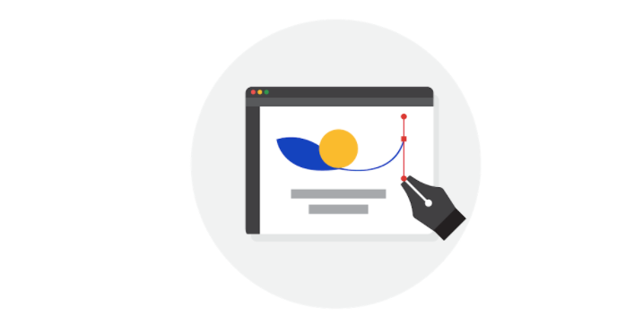
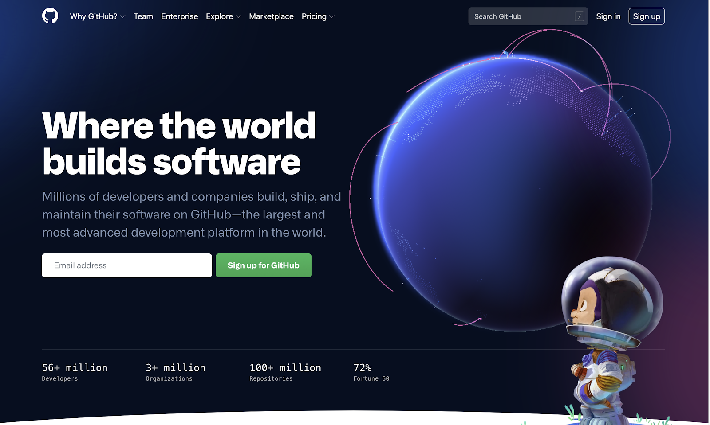
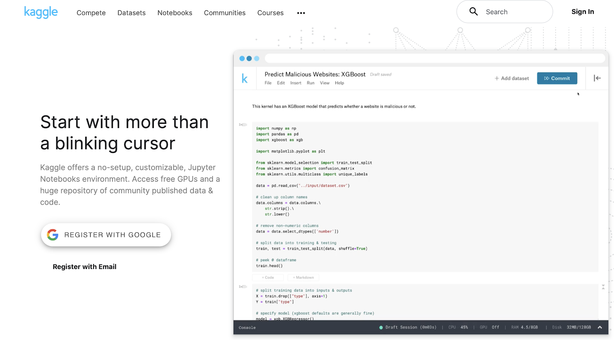

# Reading: Explore Portfolios

Earlier, you learned that a portfolio contains samples that you share with potential employers. Case studies are practice or example data analytics projects that you can create for your portfolio. After you have created your online portfolio, you can add a link to it on your resume. Having a portfolio to showcase who you are and demonstrate your skills will help you stand out to potential employers. The case study that you will complete in this course can be one of the examples that you add to your portfolio.

In this reading, you will learn some important things to keep in mind when building your portfolio. You will also explore GitHub and Kaggle, which are platforms that can host your portfolio. You will view the professional profiles of two data analysts and what they include in their portfolios on Kaggle.

## Ins and Outs of Building Your Portfolio

First and foremost, your portfolio should represent your own work. While getting ideas from other portfolios is inspiring, directly copying (or only slightly modifying) others’ work and sharing it in your own portfolio is never acceptable.

Additionally, if you work on a project as a data analyst, keep in mind that the work you do for an employer or client belongs to their business. In many cases, you can’t share that work publicly in your personal portfolio without direct and explicit permission from them beforehand.

Finally, be cautious even with open or public datasets. Unless you are using data that you personally collected, ask the owner of the data for permission before you post anything related to the data in your portfolio. You should always take full responsibility for what you publish by getting the right permissions as needed.

As you begin to develop your portfolio, there are a few considerations you can use to help you decide how best to incorporate your work:

- **Choose Your Projects**: Select projects that resonate with your skills and career goals. Your portfolio should reflect a range of skills that connect directly to the work you would be doing as a data analytics professional.

- **Capture Your Process**: When discussing projects with potential employers, it’s more useful to focus on your process than on your results. Describe your strategies; discuss the tools you used; and explain the decisions you made along the way, as well as why you made them. This insight gives potential employers a glimpse into your problem-solving abilities and thought processes.

- **Aesthetics Matter**: Your portfolio should be easy to navigate and visually appealing. Professionalism, simplicity, and engagement are key.

- **Tell Your Story**: Clearly explain the background of each project. What challenges did you face? What steps did you take to overcome them? And what impact did your work have? Consider all of the people who you are communicating with. Who are they and what do they need to know about you?

Now, let’s review three platforms you can use to host your portfolio.

### Personal Websites

Creating a personal website to host your portfolio is a great option because you can also use it to showcase aspects of your personality or background that contribute to your professional brand. For example, you might share a compelling experience that reflects your ability to collaborate, be resilient, or not give up. Whatever you choose to share, make sure that it is something you wouldn’t mind other people knowing about you.

For example, this visualization from data analyst [Bill Yost’s website](https://www.billyost.net/) demonstrates his ability to create a Tableau visualization but also tells a very personal story about his battle with cancer. Potential employers get an idea of his skills and find out a lot more about who he is at the same time.

Notice that although the annotations in the visualization appear somewhat crowded in the white space (per guidelines in the [Share Data Through the Art of Visualization](../../../6_Share-Data-Through-the-Art-of-Visualization/readme_course-6.md) course), the concept of sharing a personal story is the main takeaway.

### GitHub

GitHub is a hosted platform primarily used by developers as a repository for code, but it can also be used as a repository for documentation. One of the tips you have been given in this program is to keep an electronic journal of things to remember, especially for SQL or R syntax. If something in your electronic journal is particularly useful, you can create a document for your portfolio in GitHub. For inspiration, check out this [R usage tips](https://github.com/erikaduan/R-tips/blob/master/README.md) readme document a GitHub user posted.

### Kaggle

If you have an account on Kaggle, you can also use it as a platform to host your portfolio and personal background. Check out these profile examples:

- [Jesse Mostipak's profile](https://www.kaggle.com/jessemostipak)
- [Meg Risdal's profile](https://www.kaggle.com/mrisdal)

Their profiles showcase competitions they have participated in, datasets they have created, and discussions they have contributed to. Kaggle competitions are challenges that people take on at any stage of their programming and machine learning careers. Check out this YouTube video to learn [how to enter a Kaggle competition](https://www.youtube.com/watch?v=GJBOMWpLpTQ). Both Jesse’s and Meg’s profiles also include links to follow them on other social media platforms, like LinkedIn and Twitter.

Jupyter Notebook is an open-source web application that you can use to create and share documents that contain live code, equations, visualizations, and narrative text. Kaggle supports a Jupyter Notebook environment that can be accessed from a browser. Jesse and Meg also have notebooks in Kaggle. You can use Kaggle to create your own notebooks for potential employers to view.

- Click [Jesse Mostipak's Notebooks link](https://www.kaggle.com/jessemostipak/notebooks) to view her notebooks
- Click [Meg Risdal's Notebooks link](https://www.kaggle.com/mrisdal/notebooks) to view her notebooks