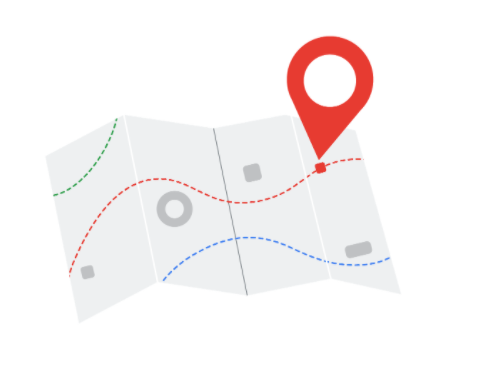

# Revisit Career Paths in Data

In a reading in the [**Foundations: Data, Data, Everywhere**](../../../1_Foundations_Data-Data-Everywhere/Week-5_Data-analyst-job-opportunities/3_Optional_Exploring-your-next-job/2_READING_Data-analysts-roles-and-job-desciptions.md) course, you learned about three different career paths in data science: data analyst, data scientist, and data specialist. This reading revisits the data analyst career choice (first column in the table below) to explore how the skills you have learned in this program match up with real job requirements.

## Mapping Certificate Skills to Job Requirements

The skills you gain with the Google Data Analytics Certificate align with skills that data analyst jobs require. When you create your resume, the way you present your skills can capture the attention of a recruiter or a hiring manager. Many career counselors recommend that you customize your resume each time you apply for a job so that your experience and skills align as closely as possible with the requirements listed in the job description.

For each of the relevant skills in the previous table, consider the following:

- **Possible Phrases from Job Descriptions**
- **Examples of Matching Skills from This Certificate**

Let’s go through the skills for data analysts and examine common phrases you might find in job descriptions.

### Skill: Database Queries

| **Job Description Phrase**  | **Skills from This Program You Could Include in Your Resume**  |
| -------------------------------------------------------- | --------------------------------- |
| - Collect data by using a scripting language such as SQL | - Perform SQL queries  - Sort and filter data using SQL queries - Convert data types using SQL functions |

### Skill: Data Visualization

| **Job Description Phrase**  | **Skills from This Program You Could Include in Your Resume**  |
| -------------------------------------------------------- | --------------------------------- |
| - Visualize data insights and communicate your findings to teams in other organizations | - Create data visualizations using Tableau   - Create visuals in spreadsheets   - Create presentations from data analysis results|

### Skill: Dashboards

| **Job Description Phrase**  | **Skills from This Program You Could Include in Your Resume**  |
| -------------------------------------------------------- | --------------------------------- |
| - Build and train users of new dashboards | - Identify the data needs of users  - Create dashboards using Tableau   - Use design thinking to improve dashboards|

### Skill: Reports

| **Job Description Phrase**  | **Skills from This Program You Could Include in Your Resume**  |
| -------------------------------------------------------- | --------------------------------- |
| - Create comprehensive reports |   - Create data cleaning reports   - Create and maintain change logs    - Create reports in R Markdown|

### Skill: Spreadsheets

| **Job Description Phrase**  | **Skills from This Program You Could Include in Your Resume**  |
| -------------------------------------------------------- | --------------------------------- |
|- Explore and analyze datasets with spreadsheets |  - Clean data in spreadsheets    - Sort and filter data in spreadsheets  - Create pivot tables in spreadsheets|

## Skill: Programming

This is an area where you can potentially distinguish yourself from other candidates when you apply for a data analyst position. Programming is considered a more advanced or higher-level skill and might not even be in a job description for a junior data analyst role. You learned to use R for data analysis as part of this program, and adding programming skills to your resume might make your application stand out.

| **Job Description Phrase**  | **Skills from This Program You Could Include in Your Resume**  |
| -------------------------------------------------------- | --------------------------------- |
| - Knowledge of some programming languages and an organized and methodical approach to work | - Install and use the tidyverse package in R   - Run scripts in RStudio   - Create data visualizations in RStudio |

## Aiming for More Technical Roles

If your goal is to work in a more technical role like a data scientist, the Google Data Analytics Certificate is a good starting point. But you might need to pursue additional learning opportunities to advance your skills, such as:

- Completing other professional certificates (Coursera offers many)
- Registering for college courses as a part-time or full-time student and applying for paid internships
- Continuing your education in a four-year college degree program like computer science, data science, or management information systems

## Build Your Career Identity

Your career identity is the unique value you bring to the workforce. [Watch this video](https://www.youtube.com/watch?v=_xbT4qMrot4) to learn about the key components of career identity and write your own career identity statement. Discovering and defining your own career identity makes you better equipped to choose a career path that aligns with your strengths, values, and goals and is more effective in your chosen profession.

For more information about career paths in data science, including roles that are more technical, refer to this article on Medium: [Career Paths Within Data Science](https://medium.com/ds3ucsd/career-paths-within-data-science-4243679c04b9).