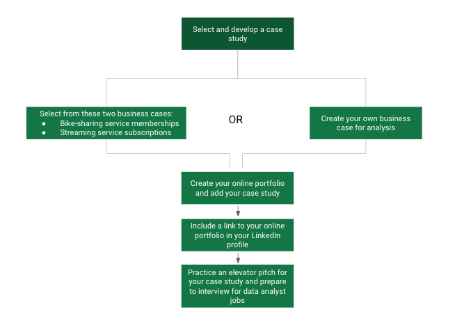

# Reading: Next steps

The Capstone Project case study is an optional component of these courses. However, it is highly recommended as an opportunity to demonstrate everything you’ve learned so far and build your portfolio for future job applications. The following diagram provides an overview of the next steps that you will take to finish this course. You will complete a case study, create an online portfolio, update your LinkedIn profile, and prepare to interview for data analyst jobs.

Sections of this reading will direct you to resources in this course and other courses in the program that will help you complete each step.

## Selecting and Developing a Case Study

In this course, you have options for selecting and developing a case study. You can choose one of two possible tracks.

- The first track has two cases already defined. You can pick one of these cases and follow through on the data analysis to answer the questions presented to address business problems. For more information, refer to the [track A details]().
  
- The second track allows you to design your own case study about a topic that you are interested in. You can practice all but the Act phase of the Data Analysis Process: Ask, Prepare, Process, Analyze, Share, and Act. For more information, refer to the [track B details](#). You can also return to [The phases of data analysis and this program](#) video to review the steps of the Data Analysis Process.

After familiarizing yourself with the details of each track, refer to the information in [Choose your case study track](#) and decide which track you want to follow.

### Creating Your Online Portfolio

After completing your case study, you will create an online portfolio to store and display it. Refer to [Create your online portfolio](#). It provides an overview of platforms that can potentially host your portfolio and case study.

### Updating Your LinkedIn Profile

In an earlier course, you learned about creating an online presence with a LinkedIn account in [Getting started with LinkedIn](#). Access your LinkedIn profile again to add a link to your online portfolio in your profile.

### Practicing Your Case Study Pitch

You can start to prepare for interviews by creating an elevator pitch for your case study. Refer to [What makes a great pitch](#) to understand the kinds of questions to prepare for. Try to include aspects of your elevator pitch in your answers to the sample questions provided in the reading. Then, practice pitching your case study as part of your planned responses to commonly asked interview questions.