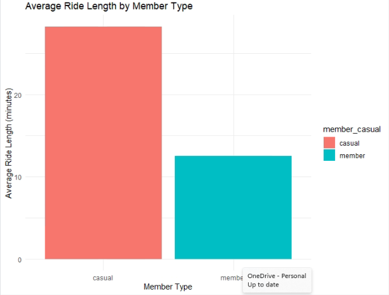
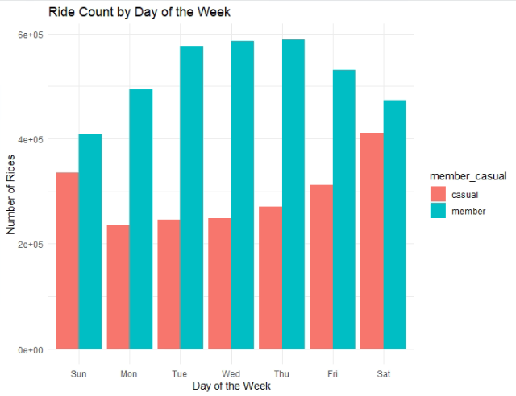
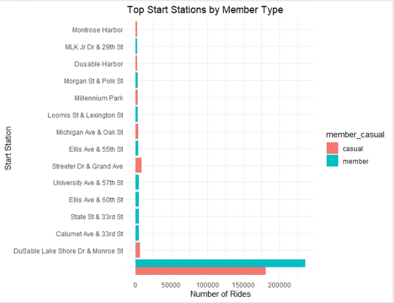

# Google Data Analytics Capstone Project - Case Study

Hi there, over the few months, I've been working on the Google Data Analytics Professional Certificate through Coursera.

With 8 courses including, Google team takes me through the Data analytics phases:

At the last course, we have capstone projects which are required as a part of the certificate - junior data analyst skill.

- Case study 1:
- Case study 2:
- My own case study: //TODO: choose the topics  that related to COVID-19

This article would be sharing how I approached and completed the Case Study 1 which I encapsulated-applied all of the learned| achieved skills from the course, I will perform many real-worlds tasks of a junior data analyst

## Table of Contents

- [Google Data Analytics Capstone Project - Case Study](#google-data-analytics-capstone-project---case-study)
  - [Table of Contents](#table-of-contents)
  - [Case Study 1: How does a bike-share navigate speedy success?](#case-study-1-how-does-a-bike-share-navigate-speedy-success)
    - [Introduction](#introduction)
      - [Scenario](#scenario)
      - [Background](#background)
    - [1. ASK](#1-ask)
    - [2. PREPARE](#2-prepare)
      - [Data Organization](#data-organization)
      - [PREPARE: step by step](#prepare-step-by-step)
    - [3. PROCESS](#3-process)
    - [4. ANALYZE](#4-analyze)
    - [5. SHARE](#5-share)
      - [Sharing Findings](#sharing-findings)
      - [Presentation of Findings](#presentation-of-findings)
    - [6. ACT](#6-act)
  - [Case Study 2](#case-study-2)

## Case Study 1: How does a bike-share navigate speedy success?

### Introduction

#### Scenario

I am assuming to be/play the role as a junior data analyst working in the marketing analyst team at Cyclistic, a bike-share company in Chicago. The director of marketing believes the company’s future success depends on maximizing the number of annual memberships. Therefore, my team wants to understand how casual riders and annual members use Cyclistic bikes differently. From these insights, my team will design a new marketing strategy to convert casual riders into annual members. But first, Cyclistic executives must approve our recommendations, so they must be backed up with compelling data insights and professional data visualizations.

#### Background

Cyclistic

A bike-share program that features more than 5,800 bicycles and 600 docking stations. Cyclistic sets itself apart by also offering reclining bikes, hand tricycles, and cargo bikes, making bike-share more inclusive to people with disabilities and riders who can’t use a standard two-wheeled bike. The majority of riders opt for traditional bikes; about 8% of riders use the assistive options. Cyclistic users are more likely to ride for leisure, but about 30% use them to commute to work each day.

About the company

In 2016, Cyclistic launched a successful bike-share offering. Since then, the program has grown to a fleet of 5,824 bicycles that are geotracked and locked into a network of 692 stations across Chicago. The bikes can be unlocked from one station and returned to any other station in the system anytime.

Until now, Cyclistic’s marketing strategy relied on building general awareness and appealing to broad consumer segments. One approach that helped make these things possible was the flexibility of its pricing plans: single-ride passes, full-day passes, and annual memberships. Customers who purchase single-ride or full-day passes are referred to as casual riders. Customers who purchase annual memberships are Cyclistic members.

Cyclistic’s finance analysts have concluded that annual members are much more profitable than casual riders. Although the pricing flexibility helps Cyclistic attract more customers, Moreno (the director of marketing and my manager) believes that maximizing the number of annual members will be key to future growth. Rather than creating a marketing campaign that targets all-new customers, Moreno believes there is a very good chance to convert casual riders into members. She notes that casual riders are already aware of the Cyclistic program and have chosen Cyclistic for their mobility needs.

Moreno has set a clear goal: Design marketing strategies aimed at converting casual riders into annual members. In order to do that, however, the marketing analyst team needs to better understand how annual members and casual riders differ, why casual riders would buy a membership, and how digital media could affect their marketing tactics. Moreno and her team are interested in analyzing the Cyclistic historical bike trip data to identify trends.

This case study will be analyzed using 6 steps of the Data Analysis process: ASK, PREPARE, PROCESS, ANALYZE, SHARE, and ACT.

I will utilize R and RStudio for data analysis processing. I am using R because the dataset is too large for spreadsheets, and R allows for in-depth analysis and manipulation.

### 1. ASK

> Main objective for this project: To understand how casual riders and annual members use Cyclistic bikes differently.

In the “Ask” phase, these are the questions/business tasks that would guide the future of the marketing program:

- Key tasks:
  - [x] Identify the business task: `What attracts casual members to become annual members?`
  - [x] Consider key stakeholders:
    - `Director of Marketing/Manager - Moreno`: who is responsible for the development of campaigns and initiatives to promote the bike-share program.
    - `Executives teams`: The notoriously detail-oriented executive team will decide whether to approve the recommended marketing program.
    - `Analytics teams`: The team responsible for collecting, analyzing, and reporting data that helps guide Cyclistic marketing strategy.
- Deliverable:
  - A clear statement of the business task: `The key things to attract riders to become annual members`
  - What is the problem you are trying to solve?: Answer the question `How do annual members and casual riders use Cyclistic bikes differently?` to create a marketing strategy to convert casual riders into annual members.
  - How can your insights drive business decisions?: `Identify the differences between Annual Members and Casual Riders when they use the Cyclistic bikes to define strategy and design the marketing campaign to attract more members. By doing so, profit can increase quickly.`

### 2. PREPARE

- In the “Prepare” phase, there are some key tasks need to be completed:
  - [x] Download data and store it appropriately.
  - [x] Identify how it’s organized.
  - [x] Sort and filter the data.
  - [x] Determine the credibility of the data.

Answer some guiding questions before delving into the data to ensure the data is ready for analysis:

- Are there issues with bias or credibility in this data? Does your data ROCCC?
  - `The data is Reliable: data is provided by the first party - Lyft Bikes and Scooter company which operate the City of Chicago's Divvy bicycle sharing service.`
  - `The data is Original: it was created by Motivate International Inc. as the primary party that was validated as the original source.`
  - `Comprehensive: data contains complete information for analysis.`
  - `Current: data is up-to-date until the current time in 2024.`
  - `Cited: The data is cited & credible, which comes from Lyft Bikes and Scooters, LLC (“Bikeshare”), which operates the City of Chicago’s (“City”) Divvy bicycle sharing service. Bikeshare and the City are committed to supporting bicycling as an alternative transportation option. As part of that commitment, the City permits Bikeshare to make certain Divvy system data owned by the City (“Data”) available to the public.`
- How are you addressing licensing, privacy, security, and accessibility?:
  - `The data is open and is maintained & made available by Motivate International Inc., and follows the issued Data License Agreement on https://divvybikes.com/data-license-agreement.`
- How did you verify the data’s integrity?: `The data was examined and verified for integrity with the consistency of columns (name, quantity,.. ), data type.`
- How does it help you answer your question? `The data will enable us to analyze both annual members and casual riders to identify any significant traits related to the riders, their bike usage, and their requirements.`
  - The information can be found in the data will examine annual members and casual riders to determine their main characteristics such as: rider's bike type, trip info, riding time,... which
- Are there any problems with the data?
  - `It can be better if the data provides more information regarding the measuring unit of time, stations,...`

Cyclistic's historical data - which is open to the public and kept on cloud. The data has been made available by Motivate International Inc.

The Cyclistic trip data is available [here](https://divvy-tripdata.s3.amazonaws.com/index.html) that are historical trip data from 2013 to 2024.

#### Data Organization

The data consists of CSV files and is organized by quarters in the year from 2013 to 2019 and by month from 2020 to 2024. Each CSV file is structured utilizing rows and columns.

At the time I perform this analysis in June 2024, I use Cyclistic’s historical trip data in 2023 to analyze.

There are 12 files with the naming convention of `YYYYMM-divvy-tripdata.csv` and each file includes information for one month:

- Ride id: ride_id - the identity of each data record
- Bike type: rideable_type
- Start time: started_at
- End time: ended_at
- Start station: start_station_id, start_station_name, start_lat, start_lng
- End station: end_station_id, end_station_name, end_lat, end_lng
- Start location:
- End location:
- Whether the rider is a member or not: member_casual

#### PREPARE: step by step

- Firstly, we would need to install & load the packages required for this process, which in this case will be: Tidyverse, Janitor & Lubridate.

  ```R
  install.packages('tidyverse')
  install.packages('janitor')
  install.packages('lubridate')
  ```

- Subsequently, we need to collect data from downloaded data files. The data is stored in .zip files, so we have to extract them. As I chose the 2023 dataset, I will get 12 .csv files, one file representing one month of trip data.
- We will use the function `read.csv()` of package:utils to import CSV files into RStudio. Before this, we must know the working directory to input the right path of CSV files as parameters to `read.csv()`

  ```R
  #=====================
  # STEP 1: COLLECT DATA
  #=====================
  getwd() # Get working directory
  setwd("./input-data/") # Set working directory

  m01 <- read.csv("./input-data/202301-divvy-tripdata.csv")
  m02 <- read.csv("./input-data/202302-divvy-tripdata.csv")
  m03 <- read.csv("./input-data/202303-divvy-tripdata.csv")
  m04 <- read.csv("./input-data/202304-divvy-tripdata.csv")
  m05 <- read.csv("./input-data/202305-divvy-tripdata.csv")
  m06 <- read.csv("./input-data/202306-divvy-tripdata.csv")
  m07 <- read.csv("./input-data/202307-divvy-tripdata.csv")
  m08 <- read.csv("./input-data/202308-divvy-tripdata.csv")
  m09 <- read.csv("./input-data/202309-divvy-tripdata.csv")
  m10 <- read.csv("./input-data/202310-divvy-tripdata.csv")
  m11 <- read.csv("./input-data/202311-divvy-tripdata.csv")
  m12 <- read.csv("./input-data/202312-divvy-tripdata.csv")
  ```

- Examine datasets: all datasets have the same column names & data types

  ```R
  str(m01)
  str(m02)
  str(m03)
  str(m04)
  str(m05)
  str(m06)
  str(m07)
  str(m08)
  str(m09)
  str(m10)
  str(m11)
  str(m12)
  ```

- All 12 datasets have 13 columns with the same data types:
  - `ride_id`           : character
  - `rideable_type`     : character
  - `started_at`        : character
  - `ended_at`          : character
  - `start_station_name`: character
  - `start_station_id`  : character
  - `end_station_name`  : character
  - `end_station_id`    : character
  - `start_lat`         : number
  - `start_lng`         : number
  - `end_lat`           : number
  - `end_lng`           : number
  - `member_casual`     : character

- Merge the 12 datasets into one data frame

### 3. PROCESS

- Key tasks
  - [x] Check the data for errors.
  - [x] Choose tools.
  - [x] Transform the data so you can work with it effectively.
  - [x] Document the cleaning process.

As mentioned above, I will utilize R & RStudio for data processing.

I examined the columns after making changes and confirmed that the data types remained consistent following manipulation.

To ensure that the data is clean and ready to analyze, I will perform the following steps using some R packages (**tidyverse**, **dplyr**):

- Remove NA and duplicate values.
- Format the data columns with dates and times.
- Create new aggregation columns for analysis.

The cleaning process has been thoroughly documented.

  ```R
  library(tidyverse)
  library(janitor)
  library(lubridate)
  library(ggplot2)

  # Combine all data frames into one
  cyclistic_data <- bind_rows(m01, m02, m03, m04, m05, m06, m07, m08, m09, m10, m11, m12)

  # Clean column names
  cyclistic_data <- clean_names(cyclistic_data)

  # Convert date columns to datetime
  cyclistic_data <- cyclistic_data %>%
    mutate(started_at = ymd_hms(started_at),
           ended_at = ymd_hms(ended_at))

  # Calculate ride length and day of the week
  cyclistic_data <- cyclistic_data %>%
    mutate(ride_length = as.numeric(difftime(ended_at, started_at, units = "mins")),
           day_of_week = wday(started_at, label = TRUE))

  # Remove any NA or negative ride lengths
  cyclistic_data <- cyclistic_data %>%
    filter(!is.na(ride_length) & ride_length > 0)

  # Examine the cleaned data
  glimpse(cyclistic_data)
  ```

### 4. ANALYZE

- Key tasks
  - [x] Aggregate the data so it’s useful and accessible.
  - [x] Organize and format your data.
  - [x] Perform calculations.
  - [x] Identify trends and relationships.

In this phase, I will perform the following analyses:

- Descriptive analysis: Calculate the average ride length by member type.
- Analyze ride counts by day of the week.
- Examine start and end station usage to identify popular stations for both member types.

  ```R
  # Descriptive analysis: average ride length by member type
  avg_ride_length <- cyclistic_data %>%
    group_by(member_casual) %>%
    summarise(mean_ride_length = mean(ride_length),
              median_ride_length = median(ride_length),
              max_ride_length = max(ride_length),
              min_ride_length = min(ride_length))

  print(avg_ride_length)

  # Ride count by day of the week
  ride_count_by_day <- cyclistic_data %>%
    group_by(member_casual, day_of_week) %>%
    summarise(number_of_rides = n(),
              average_ride_length = mean(ride_length)) %>%
    arrange(member_casual, day_of_week)

  print(ride_count_by_day)

  # Analyze start and end station usage
  station_usage <- cyclistic_data %>%
    group_by(member_casual, start_station_name, end_station_name) %>%
    summarise(number_of_rides = n(),
              average_ride_length = mean(ride_length)) %>%
    arrange(desc(number_of_rides))

  print(head(station_usage, 20))
  ```

### 5. SHARE

- Key tasks
  - [x] Determine the best way to share your findings.
  - [x] Create effective data visualizations.
  - [x] Present your findings.
  - [x] Ensure your work is accessible.

In this phase, I will create visualizations to share the findings effectively:

- **Visualization: Average Ride Length by Member Type**: A bar chart to compare the average ride length between casual and annual members.
- **Visualization: Ride Count by Day of the Week**: A bar chart to visualize ride activity across the week for both member types.
- **Visualization: Popular Start and End Stations**: A bar chart to show the top 10 start stations for each member type, giving insights into which stations are most frequently used.

  ```R
  # Visualization: Average ride length by member type
  ggplot(avg_ride_length, aes(x = member_casual, y = mean_ride_length, fill = member_casual)) +
    geom_bar(stat = "identity", position = "dodge") +
    labs(title = "Average Ride Length by Member Type",
         x = "Member Type",
         y = "Average Ride Length (minutes)") +
    theme_minimal()

  # Visualization: Ride count by day of the week
  ggplot(ride_count_by_day, aes(x = day_of_week, y = number_of_rides, fill = member_casual)) +
    geom_bar(stat = "identity", position = "dodge") +
    labs(title = "Ride Count by Day of the Week",
         x = "Day of the Week",
         y = "Number of Rides") +
    theme_minimal()

  # Visualization: Popular start and end stations by member type
  top_stations <- station_usage %>% 
    filter(member_casual %in% c("member", "casual")) %>%
    group_by(member_casual) %>%
    top_n(10, number_of_rides)

  ggplot(top_stations, aes(x = reorder(start_station_name, -number_of_rides), y = number_of_rides, fill = member_casual)) +
    geom_bar(stat = "identity", position = "dodge") +
    coord_flip() +
    labs(title = "Top Start Stations by Member Type",
         x = "Start Station",
         y = "Number of Rides") +
    theme_minimal()
  ```

#### Sharing Findings

Based on the analysis and visualizations, here are the key findings:

1. **Average Ride Length by Member Type**:
   - Casual riders have a significantly longer average ride length (28.3 minutes) compared to annual members (12.5 minutes). This indicates that casual riders might be using the bikes for leisure or longer trips, while annual members likely use them for shorter, more frequent trips such as commuting.

   

2. **Ride Count by Day of the Week**:
   - Casual riders have higher ride counts on weekends, especially on Saturdays and Sundays. In contrast, annual members have a more consistent ride count throughout the week, with a slight increase on weekdays, particularly on Tuesdays and Wednesdays.

   

3. **Popular Start and End Stations by Member Type**:
   - The most popular start and end stations vary significantly between casual riders and annual members. Some stations, like "DuSable Lake Shore Dr & Monroe St" and "Streeter Dr & Grand Ave," are highly frequented by casual riders. On the other hand, annual members show a more distributed usage across various stations.

   

#### Presentation of Findings

To present these findings:

1. **Slide Deck**:
   - Create a PowerPoint or Google Slides presentation highlighting the key findings with the visualizations.
   - Include an executive summary at the beginning, followed by detailed slides on each analysis.
   - Conclude with actionable recommendations based on the insights.

2. **Report**:
   - Write a detailed report that includes the introduction, methodology, analysis, visualizations, and conclusions.
   - Provide appendices with the R code used for the analysis for transparency and reproducibility.

3. **Interactive Dashboard**:
   - Consider creating an interactive dashboard using tools like Tableau or Power BI to allow stakeholders to explore the data further.

### 6. ACT

- Key tasks
  - [x] Determine the best way to share your findings.
  - [x] Create effective data visualizations.
  - [x] Present your findings.
  - [x] Ensure your work is accessible.

In the "Act" phase, I will:

- Prepare a comprehensive report with all findings, insights, and visualizations.
- Create a presentation to share with key stakeholders, ensuring the data is accessible and understandable.
- Use the insights gained to make actionable recommendations for the marketing strategy aimed at converting casual riders into annual members.

## Case Study 2
