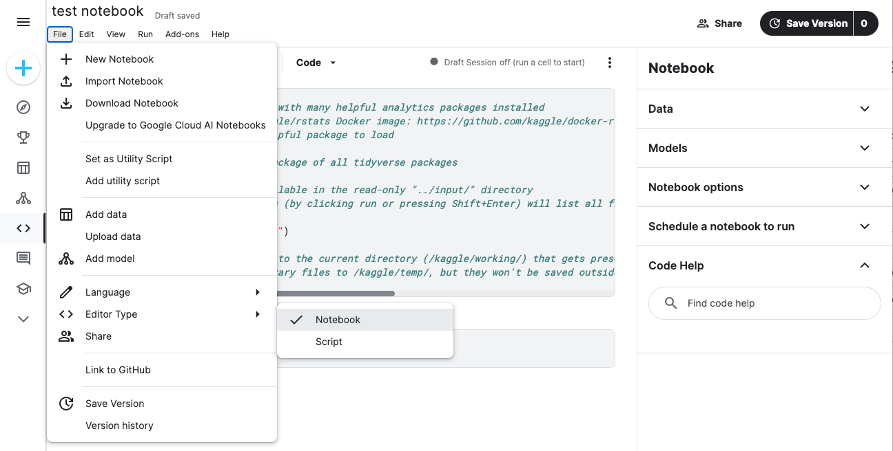
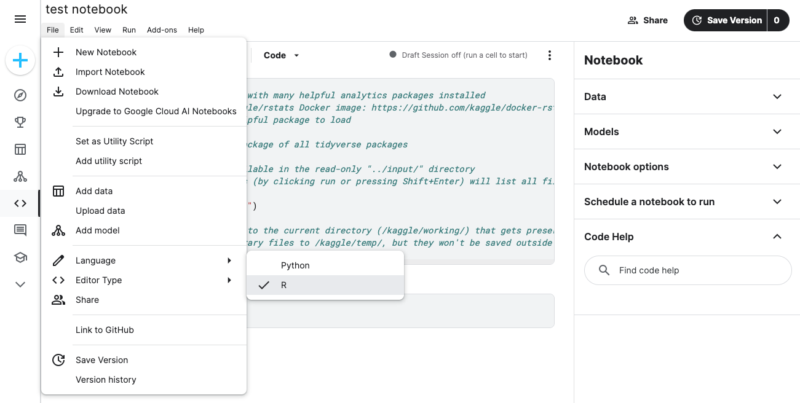
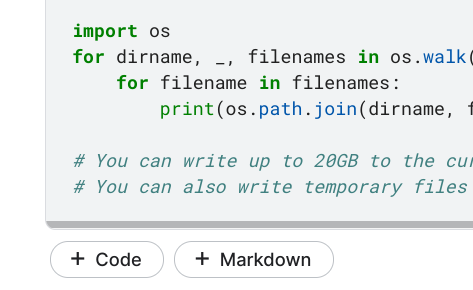

# Practice Quiz: Hands-On Activity: Add your portfolio to Kaggle

## Activity Overview

Earlier in this course, you learned about what to put in an effective data analyst portfolio. In this activity, you will add your portfolio content to a Kaggle notebook.

As you create your data analytics portfolio, you might find yourself using Kaggle or another online platform to host it. Kaggle hosts interactive notebooks that let you showcase your programming and hard work. If you have an existing portfolio, you can copy your content into Kaggle to have an additional way to share it.

By the time you complete this activity, you will have created a Kaggle notebook containing your portfolio content. Then you can easily share your work with a Kaggle link, enabling you to send your portfolio to more people.

## Step 1: Review type of Kaggle NoteBooks

First, it’s helpful to know the different kinds of Notebooks on Kaggle. Every kind of Kaggle Notebook uses code, but each one contains different languages for programming or writing text. The different types include: 

- Scripts: Typically, these are code-only documents. Cells can be formatted in R or Python, and they execute each cell as code sequentially. 
- RMarkdown scripts: Cells can be formatted in R and RMarkdown. These files are preferred by many R authors.
- Jupyter Notebooks: Cells can be formatted in Markdown, R, or Python. These are the most flexible.

Before you create a Notebook in Kaggle, decide which kind of Notebook you intend to use.

To share the code you wrote in this course, choose a Kaggle Notebook that supports R and Markdown, such as an R Markdown script or a Jupyter Notebook.

## Step 2: Add R to yout Notebook

1. To begin, log in to Kaggle and go to [Kaggle.com/code](https://www.kaggle.com/code).

2. Select + Create and select < > New Notebook to create a new notebook. If you want to use an existing notebook, go to the Your work tab and scroll to the notebook you want to use.

3. Decide whether to use a type of script or a Jupyter notebook based on your project’s needs. The editor will begin as a notebook by default. If you want to change your notebook to a script, click on File at the top of your editor and hover over Editor Type. This opens a drop-down menu to select Notebook or Script. For this activity, select Notebook.

    

4. Because the work you did in the last course was in R instead of Python, you need to change the notebook’s language. Select File at the top of your editor and hover over Language. This opens a dropdown menu with both options available. Select R if it isn’t selected already.

    

5. Open the file of a project you want to use in your portfolio. This can be the capstone project you completed during this course, an earlier activity you completed in a past course, or a personal project you created. Ideally, this project should demonstrate your coding ability and your data analytics knowledge. 

6. Add the content of your portfolio piece. Copy the code you wrote into R cells and copy regular text or images into Markdown cells. To add a cell to the document, select + Code or + Markdown. It helps to test your code in the Kaggle interface by running it periodically as you write or copy it in. This way, you ensure that it doesn’t return an error.

    

7. Repeat steps 2-6 to upload your portfolio pieces to their own Kaggle notebooks. 

You have now created (or duplicated) your portfolio in Kaggle! Your next step is to publish your portfolio.