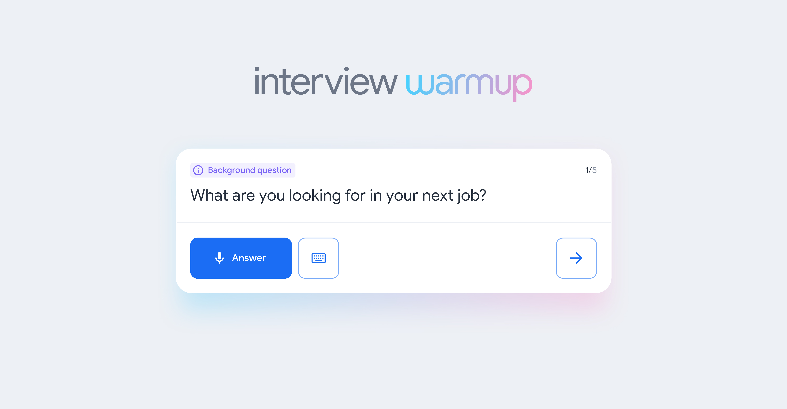

# Prepare for interviews with Interview Warmup

Now that you have the skills and knowledge to work in data analytics, it’s time to start preparing for interviews. [Interview Warmup](https://grow.google/certificates/interview-warmup/) is a tool that helps you practice answering questions to get more confident and comfortable with interviewing.

## Get started

Follow these steps to start a 5-question practice interview related to data analytics:

1. Go to [grow.google/interview-warmup](http://grow.google/interview-warmup).
2. Click **Start practicing**.
3. Select the **Data Analytics** practice set.
4. Click **Start**.

It takes about 10 minutes, and the questions will be different every time. Each question set will have two background questions, one behavioral question, and two technical questions, simulating what you would encounter in a real interview. You can try as many practice interviews as you want.

You’ll also have the option to access the full list of interview questions if you’d like to review more of the questions available or focus on specific topics.

## How it works

Interview Warmup asks interview questions for you to practice answering out loud. It transcribes your answer in real time so you can review what you said. You’ll also review insights, which are patterns detected by machine learning that can help you discover things about your answers and identify ways to keep improving.

Here are a few examples of questions the tool might ask:
- Can you tell me why you are interested in a role in data analytics?
- Describe the difference between structured and unstructured data.
- Imagine you've run into a challenge with an analysis and you aren't sure how to address it. What are some steps you might take to seek help?
- Can you describe what a subquery is in SQL?
- What is reproducible data analysis? What are some of its benefits?

## Insights Provided by Interview Warmup

- **Talking points:** The tool lets you know which topics you covered in your answer, such as your experience, skills, and goals. You’ll also be able to view other topics that you might want to consider covering.
- **Most-used words:** The tool highlights the words you used most often and suggests synonyms to broaden your word choices.
- **Job-related terms:** The tool highlights the words you used that are related to the role or industry in which you are preparing to work. You’ll also be able to view an entire list of job-related terms that you might want to consider including in your answer.

Interview Warmup gives you the space to practice and prepare for interviews on your own. Your responses will be visible only to you, and they won’t be graded or judged.

## Key takeaways

Practicing for interviews is an important skill for your career in data analytics. Using Interview Warmup can help you practice interview questions and receive feedback in real time. As you practice, you will gain confidence and be able to prepare more polished responses for common interview questions.
