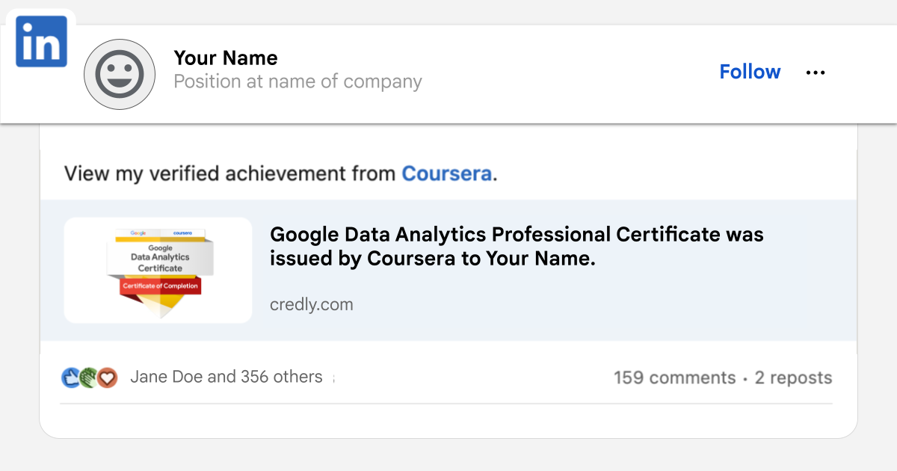

# Practice Quiz: Resources available for Google Data Analytics Certificate graduates
// TODO
## Question 1

**Have you finished all eight courses in the Google Data Analytics Certificate?**

Congratulations on completing the Google Data Analytics Certificate! Your dedication has unlocked exclusive career-boosting resources and benefits. Access and share your badge of completion, receive personalized career guidance, and sharpen your interview skills.

To claim these at no-cost resources, simply access each using the same email address you used when registering for the certificate on Coursera. Please note that these benefits are only available to graduates who have completed all eight courses in the Google Data Analytics Certificate program.

- [x] Complete the Google Data Analytics Certificate (Done!)
- [ ] Claim your Google Data Analytics badge and share it with your professional network.
  - Look for an email from Credly (<admin@credly.com>) within one week of completing the certificate.
  - Claim your badge on Credly’s Acclaim platform using the email address linked to your Coursera account. You’ll need to opt in to share your information for the purposes of badge issuing.
  - Add the badge to your LinkedIn to highlight your skills by following the steps in this [Credly article](https://support.credly.com/hc/en-us/articles/360021221491-How-can-I-add-my-badge-to-my-LinkedIn-profile-and-share-to-my-feed-) or [video tutorial](https://vimeo.com/725834127?embedded=true&source=vimeo_logo&owner=149323741).

- [ ] Showcase your new skills and expand your professional network
- [ ] Share your accomplishment on social media using our [sample posts and prompts](https://grow.google/certificates/sample-posts-and-prompts), and include #GrowwithGoogle for greater visibility.
- [ ] Connect with a community of learners and discover new opportunities
- [ ] Follow Grow with Google on LinkedIn to join a network of like-minded individuals and explore further learning possibilities.
- [ ] Get career support from [CareerCircle](https://www.careercircle.com/) at no cost (US graduates only). Google is giving certificate graduates like you free access to career support from CareerCircle, including a resume builder and interview preparation resources to help you land your next job. Plus, you’ll get access to free 1-on-1 career coaching and thousands of job postings from top employers. You must be eligible to work in the U.S. to unlock this resource.
- [ ] Improve your interview technique with [Interview Warmup](https://grow.google/interview-warmup). Practice interviewing with Interview Warmup, a tool built by Google with certificate graduates in mind. Access data analytics-specific practice questions, transcripts of your responses, and automatic insights that help you grow your skills and confidence.
- [ ] Access free interview practice and job search tips with [Big Interview](https://googlecerts.biginterview.com/). Get practice with mock interviews, job search tips, and customizable resume templates with Big Interview, available free for one year to Google Career Certificate graduates.
- [ ] Inspire others by sharing your story. Stories from successful graduates, like you, can encourage the next generation of learners to pursue their passions. In addition, your feedback helps us improve the certificate program. Fill out [this short survey](https://www.coursera.org/learn/google-data-analytics-capstone/survey) to tell us about your journey.

### Key Points

- **Claim Your Badge:**
  - Look for an email from Credly.
  - Claim your badge on Credly’s Acclaim platform.
  - Add the badge to LinkedIn.

- **Showcase Skills:**
  - Share your accomplishment on social media using #GrowwithGoogle.
  - Follow Grow with Google on LinkedIn.

- **Career Support:**
  - Access CareerCircle for career support (US graduates only).
  - Use Interview Warmup to practice interview skills.
  - Access Big Interview for mock interviews and job search tips.

- **Inspire Others:**
  - Share your story and provide feedback through the survey.
